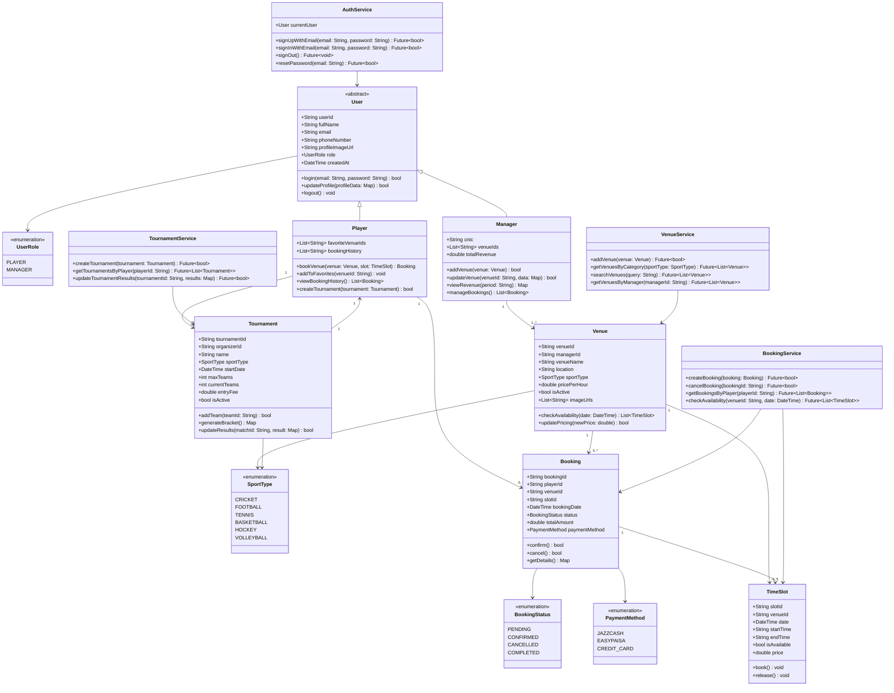

# PlaySphere Application - Class Diagram

## Overview
This document contains the core class diagram for the PlaySphere sports venue booking application with essential entities and relationships.

---

## Mermaid Class Diagram

---

## Main Features

### 1. User Management
- **Player**: Books venues, joins tournaments
- **Manager**: Manages venues, approves bookings

### 2. Venue Booking
- Browse available venues by sport type
- Check time slot availability
- Book and pay for venue slots
- Cancel bookings with refunds

### 3. Payment Processing
- Multiple payment methods (JazzCash, EasyPaisa)
- Secure transaction processing
- Automatic invoice generation
- Refund handling

### 4. Tournament Management
- Players organize tournaments
- Team registration and management
- Tournament scheduling at venues
- Prize pool management

### 5. Notifications
- Booking confirmations
- Payment status updates
- Tournament invitations
- Venue updates

---

*PlaySphere - Sports Venue Booking Platform*
