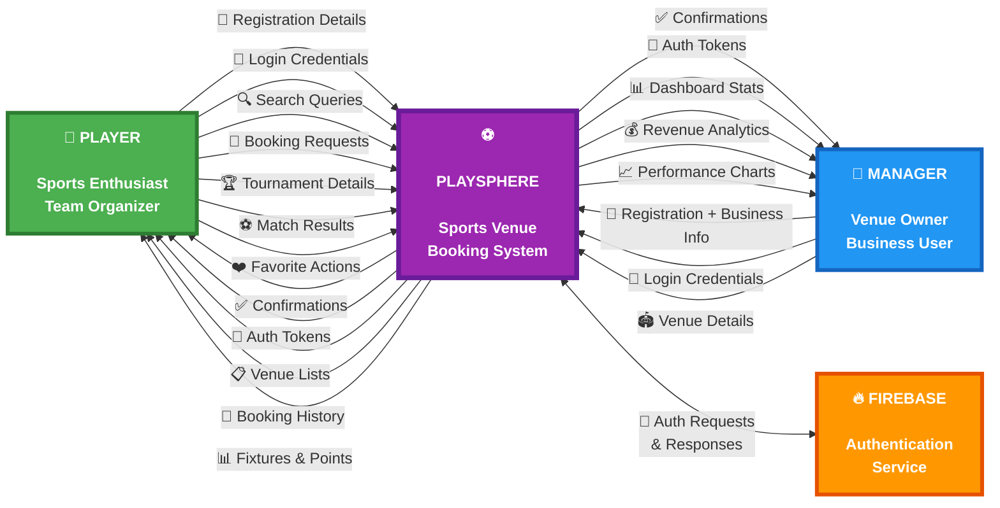
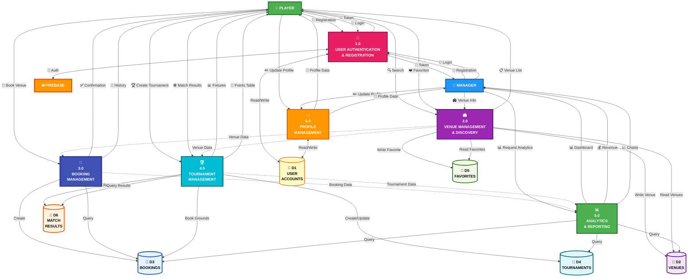

# PlaySphere - Data Flow Diagrams (DFD)
## Sports Venue Booking System

**Version:** 1.0  
**Date:** December 3, 2024  
**Prepared by:** PlaySphere Development Team

---

## Table of Contents
1. [Introduction](#introduction)
2. [DFD Level 0 - Context Diagram](#dfd-level-0---context-diagram)
3. [DFD Level 1 - System Decomposition](#dfd-level-1---system-decomposition)
4. [Data Dictionary](#data-dictionary)
5. [Process Descriptions](#process-descriptions)

---

## Introduction

This document presents the Data Flow Diagrams (DFD) for the PlaySphere application. DFDs illustrate how data flows through the system, showing the processes, data stores, external entities, and the relationships between them.

**DFD Notation:**
- **External Entity (Rectangle):** Users or systems that interact with PlaySphere
- **Process (Circle/Rounded Rectangle):** Operations that transform data
- **Data Store (Open Rectangle):** Where data is stored
- **Data Flow (Arrow):** Direction of data movement

---

## DFD Level 0 - Context Diagram

The Context Diagram provides a high-level view of the PlaySphere system, showing the system as a single process and its interactions with external entities.



### Context Diagram Description

**External Entities:**

1. **Player (Sports Enthusiast)**
   - Primary user who books venues
   - Creates and manages tournaments
   - Views booking history and favorites

2. **Manager (Venue Owner)**
   - Business user who manages venues
   - Views analytics and reports
   - Monitors bookings and revenue

3. **Firebase (Authentication Service)**
   - External authentication provider
   - Handles user authentication
   - Manages user sessions

**System Boundary:**
- The PlaySphere system encompasses all booking, tournament, and analytics functionalities
- Interfaces with external entities through defined data flows

---

## DFD Level 1 - System Decomposition

The Level 1 DFD breaks down the PlaySphere system into major processes, showing detailed data flows between processes and data stores.



### Level 1 Process Descriptions

#### Process 1.0: User Authentication & Registration
**Purpose:** Manage user registration, login, and authentication

**Inputs:**
- Registration data (email, password, name, role)
- Login credentials (email, password)
- Business details (for managers: CNIC, venue info)

**Outputs:**
- Authentication token
- Registration confirmation
- User session data

**Data Stores:**
- D1: User Accounts (read/write)

**External Entities:**
- Firebase Authentication

**Processing:**
- Validate user input
- Create Firebase account
- Store user profile data
- Generate authentication token
- Manage user sessions

---

#### Process 2.0: Venue Management & Discovery
**Purpose:** Handle venue browsing, searching, and favorites

**Inputs:**
- Search queries (venue name, category)
- Category filter selection
- Favorite add/remove actions
- Venue details (from managers)

**Outputs:**
- Filtered venue list
- Venue details
- Favorite venues list

**Data Stores:**
- D2: Venues (read/write)
- D5: Favorites (read/write)

**Processing:**
- Filter venues by category
- Search venues by name
- Manage favorite venues
- Display venue information
- Provide venue data to booking process

---

#### Process 3.0: Booking Management
**Purpose:** Handle venue bookings and availability

**Inputs:**
- Booking request (venue, date, slot, payment method)
- Availability check request
- Booking history request

**Outputs:**
- Booking confirmation
- Slot availability status
- Booking history list

**Data Stores:**
- D3: Bookings (read/write)
- D2: Venues (read)

**Processing:**
- Check slot availability
- Validate booking conflicts
- Handle cricket-specific slot logic
- Create booking record
- Update slot status
- Generate booking history

---

#### Process 4.0: Tournament Management
**Purpose:** Manage tournament creation, fixtures, and results

**Inputs:**
- Tournament details (name, sport, format, teams)
- Ground booking for tournament
- Match result updates

**Outputs:**
- Tournament fixtures
- Points table
- Match schedule
- Updated standings

**Data Stores:**
- D4: Tournaments (read/write)
- D6: Match Results (read/write)
- D3: Bookings (write - for tournament grounds)

**Processing:**
- Create tournament
- Generate fixtures (Round Robin/Knockout/Double Elimination)
- Book grounds for tournament
- Update match results
- Calculate points and standings
- Manage tournament progression

---

#### Process 5.0: Analytics & Reporting
**Purpose:** Generate business analytics and reports for managers

**Inputs:**
- Analytics request
- Time period filter (weekly/monthly/yearly)
- Dashboard data request

**Outputs:**
- Dashboard statistics
- Revenue charts
- Booking trends
- Performance metrics

**Data Stores:**
- D3: Bookings (read)
- D4: Tournaments (read)
- D2: Venues (read)

**Processing:**
- Calculate total bookings
- Compute revenue statistics
- Generate trend charts
- Analyze booking patterns
- Create performance reports
- Filter data by time period

---

#### Process 6.0: Profile Management
**Purpose:** Manage user profile information and settings

**Inputs:**
- Profile update request
- Profile image upload
- Password change request

**Outputs:**
- Updated profile data
- Profile image URL
- Password change confirmation

**Data Stores:**
- D1: User Accounts (read/write)

**Processing:**
- Update user information
- Handle profile image upload
- Manage password changes
- Store profile preferences
- Retrieve profile data

---

## Data Dictionary

### Data Stores

#### D1: User Accounts
**Description:** Stores user registration and profile information

**Data Elements:**
- `uid` (String): Unique user identifier from Firebase
- `email` (String): User email address
- `displayName` (String): User's full name
- `role` (String): User role (player/manager)
- `mobileNumber` (String): Contact number
- `profileImage` (String): Profile image path/URL
- `cnic` (String): Manager's CNIC (13 digits)
- `venueName` (String): Manager's venue name
- `venueLocation` (String): Manager's venue location
- `venueImages` (List): Manager's venue images
- `createdAt` (Timestamp): Account creation date

---

#### D2: Venues
**Description:** Stores sports venue information

**Data Elements:**
- `venueId` (String): Unique venue identifier
- `name` (String): Venue name
- `category` (String): Sport category (Cricket, Football, etc.)
- `location` (String): Venue address
- `images` (List): Venue images
- `managerId` (String): Owner's user ID
- `pricing` (Number): Booking price
- `facilities` (List): Available facilities
- `operatingHours` (Map): Opening/closing times
- `isFavorite` (Boolean): Favorite status per user

---

#### D3: Bookings
**Description:** Stores venue booking records

**Data Elements:**
- `bookingId` (String): Unique booking identifier
- `userId` (String): User who made booking
- `venueName` (String): Booked venue name
- `venueCategory` (String): Sport category
- `date` (String): Booking date
- `slot` (String): Time slot (Morning/Evening/Full Day)
- `paymentMethod` (String): Payment type (JazzCash/EasyPaisa/Cash)
- `amount` (Number): Booking amount
- `status` (String): Booking status (confirmed/completed/cancelled)
- `bookingType` (String): Regular or tournament booking
- `tournamentId` (String): Associated tournament (if applicable)
- `createdAt` (Timestamp): Booking creation time

---

#### D4: Tournaments
**Description:** Stores tournament information and fixtures

**Data Elements:**
- `tournamentId` (String): Unique tournament identifier
- `creatorId` (String): User who created tournament
- `name` (String): Tournament name
- `sport` (String): Sport type
- `format` (String): Tournament format (Round Robin/Knockout/Double Elimination)
- `numberOfTeams` (Number): Total teams
- `teams` (List): Team names
- `startDate` (String): Tournament start date
- `endDate` (String): Tournament end date
- `bookedGrounds` (List): Venues booked for tournament
- `matches` (List): Match fixtures
- `pointsTable` (Map): Team standings
- `status` (String): Tournament status (upcoming/ongoing/completed)
- `createdAt` (Timestamp): Creation time

---

#### D5: Favorites
**Description:** Stores user's favorite venues

**Data Elements:**
- `userId` (String): User identifier
- `venueId` (String): Favorited venue ID
- `venueName` (String): Venue name
- `venueCategory` (String): Sport category
- `venueImage` (String): Venue image
- `addedAt` (Timestamp): When added to favorites

---

#### D6: Match Results
**Description:** Stores tournament match results and scores

**Data Elements:**
- `matchId` (String): Unique match identifier
- `tournamentId` (String): Parent tournament ID
- `matchNumber` (Number): Match sequence number
- `round` (String): Tournament round (Group/QF/SF/Final)
- `team1` (String): First team name
- `team2` (String): Second team name
- `team1Score` (Number): First team score
- `team2Score` (Number): Second team score
- `winner` (String): Winning team name
- `matchDate` (String): Scheduled date
- `venue` (String): Match venue
- `status` (String): Match status (scheduled/completed)
- `updatedAt` (Timestamp): Last update time

---

### Data Flows

#### Authentication Flows
- **Registration Data:** User details for account creation
- **Login Credentials:** Email and password for authentication
- **Auth Token:** JWT token for session management
- **User Session:** Active user session data

#### Venue Flows
- **Search Query:** Text search for venues
- **Category Filter:** Sport category selection
- **Venue List:** Filtered venue results
- **Venue Details:** Complete venue information
- **Favorite Action:** Add/remove favorite request

#### Booking Flows
- **Booking Request:** Venue, date, slot, payment details
- **Availability Check:** Slot status query
- **Booking Confirmation:** Successful booking details
- **Booking History:** Past bookings list
- **Slot Status:** Available/Booked/Tournament/Unavailable

#### Tournament Flows
- **Tournament Details:** Name, sport, format, teams
- **Fixture Generation:** Automated match schedule
- **Match Results:** Score updates
- **Points Table:** Team standings
- **Tournament Booking:** Ground reservations for matches

#### Analytics Flows
- **Analytics Request:** Dashboard data query
- **Dashboard Stats:** Quick statistics (total bookings, revenue)
- **Revenue Charts:** Financial trend visualizations
- **Booking Reports:** Detailed booking analysis
- **Performance Metrics:** Business KPIs

#### Profile Flows
- **Profile Updates:** User information changes
- **Profile Image:** Photo upload
- **Password Change:** Security update request
- **Profile Data:** Current user information

---

## Process Descriptions

### Detailed Process Specifications

#### 1.0 User Authentication & Registration

**Sub-processes:**
- 1.1 Player Registration
- 1.2 Manager Registration
- 1.3 User Login
- 1.4 Password Reset
- 1.5 Session Management

**Business Rules:**
- Email must be unique and valid format
- Password minimum 8 characters
- Manager requires CNIC (13 digits)
- Manager must provide venue details
- Session expires after inactivity

**Error Handling:**
- Invalid email format
- Weak password
- Email already exists
- Invalid CNIC format
- Authentication failure

---

#### 2.0 Venue Management & Discovery

**Sub-processes:**
- 2.1 Browse Venues by Category
- 2.2 Search Venues
- 2.3 View Venue Details
- 2.4 Add to Favorites
- 2.5 Remove from Favorites

**Business Rules:**
- Categories: Cricket, Football, Tennis, Basketball, Hockey, Volleyball, ALL
- Search matches venue name or category
- Favorites persist across sessions
- Each user has independent favorites list

**Error Handling:**
- No venues found
- Search returns empty
- Favorite already exists
- Venue not found

---

#### 3.0 Booking Management

**Sub-processes:**
- 3.1 Check Slot Availability
- 3.2 Create Booking
- 3.3 Validate Booking
- 3.4 View Booking History
- 3.5 Handle Cricket Slot Logic

**Business Rules:**
- Booking date: Tomorrow to 30 days ahead
- Slots: Morning (6AM-2PM), Evening (2PM-10PM), Full Day (6AM-10PM)
- Cricket Full Day blocks both half-day slots
- Cricket half-day blocks Full Day option
- Tournament bookings block regular bookings
- Payment methods: JazzCash, EasyPaisa, Cash on Arrival

**Error Handling:**
- Slot already booked
- Invalid date selection
- Missing required fields
- Booking conflict
- Payment method not selected

---

#### 4.0 Tournament Management

**Sub-processes:**
- 4.1 Create Tournament
- 4.2 Book Tournament Grounds
- 4.3 Generate Fixtures
- 4.4 Update Match Results
- 4.5 Calculate Points Table
- 4.6 Manage Tournament Progression

**Business Rules:**
- **Round Robin:** Each team plays every other team once
  - Matches = n(n-1)/2 where n = number of teams
  - Points: Win=3, Draw=1, Loss=0
  
- **Knockout:** Single elimination
  - Requires power of 2 teams (or BYE system)
  - Rounds: QF → SF → Final
  
- **Double Elimination:** Winners and losers brackets
  - Two losses eliminate a team
  - Grand final between bracket winners

- Tournament grounds must be booked before fixture generation
- Match results update points table automatically
- Winner determined by highest points (Round Robin) or final match (Knockout)

**Error Handling:**
- Insufficient teams
- No grounds booked
- Invalid match result
- Duplicate team names
- Tournament already started

---

#### 5.0 Analytics & Reporting

**Sub-processes:**
- 5.1 Calculate Dashboard Statistics
- 5.2 Generate Revenue Charts
- 5.3 Analyze Booking Trends
- 5.4 Create Performance Reports
- 5.5 Filter by Time Period

**Business Rules:**
- Time periods: Weekly, Monthly, Yearly
- Revenue calculated from confirmed bookings
- Charts show trends over selected period
- Statistics include: total bookings, revenue, active bookings, cancelled bookings
- Only manager role can access analytics

**Metrics Calculated:**
- Total Bookings Count
- Total Revenue (PKR)
- Active Bookings
- Cancelled Bookings
- Booking Trends (line chart)
- Revenue by Category (bar chart)
- Occupancy Rate
- Peak Booking Times

**Error Handling:**
- No data for selected period
- Invalid date range
- Calculation errors
- Chart rendering failures

---

#### 6.0 Profile Management

**Sub-processes:**
- 6.1 View Profile
- 6.2 Update Profile Information
- 6.3 Upload Profile Image
- 6.4 Change Password
- 6.5 Manage Preferences

**Business Rules:**
- Profile image stored locally (SharedPreferences)
- Image formats: JPG, PNG
- Maximum image size: 5MB
- Password change requires current password
- Profile updates reflect immediately

**Error Handling:**
- Image upload failure
- Invalid image format
- Password mismatch
- Update failure
- Storage permission denied

---

## System Integration Points

### Firebase Authentication Integration
```
PlaySphere ←→ Firebase Auth
- createUserWithEmailAndPassword()
- signInWithEmailAndPassword()
- sendPasswordResetEmail()
- signOut()
- currentUser
```

### Data Persistence Strategy
```
Current Implementation:
- GlobalData (In-Memory): Session-based data
- SharedPreferences: Profile images, user preferences

Future Implementation:
- Firestore: Persistent cloud storage
- Cloud Storage: Image hosting
- Real-time sync: Live updates
```

### State Management Flow
```
User Action → UI Event → Business Logic → Data Update → UI Refresh
```

---

## Conclusion

These Data Flow Diagrams provide a comprehensive view of how data moves through the PlaySphere system. The Level 0 diagram shows the system context and external interactions, while the Level 1 diagram details the internal processes and data stores.

**Key Takeaways:**
- Clear separation of concerns across 6 major processes
- Well-defined data stores for different entities
- Comprehensive data flows between all components
- Integration with Firebase for authentication
- Scalable architecture for future enhancements

**Future Enhancements:**
- Level 2 DFDs for complex processes (Tournament Management, Analytics)
- Real-time data synchronization flows
- Payment gateway integration flows
- Notification system flows
- Chat functionality flows

---

**Document Version:** 1.0  
**Last Updated:** December 3, 2024  
**Status:** Final
