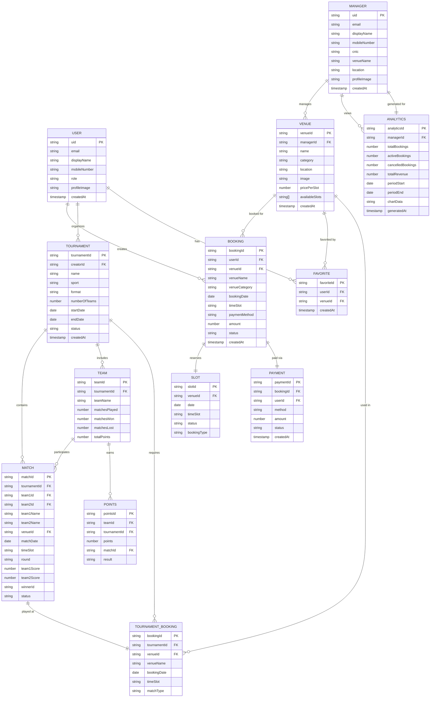

# PlaySphere - Entity Relationship Diagram

## ER Diagram (Mermaid)

## Entity Descriptions

### Core Entities

#### 1. USER (Player)
- Represents players who book venues and create tournaments
- Can have multiple bookings, tournaments, and favorites
- Authenticated via Firebase Authentication

#### 2. MANAGER
- Represents venue owners/managers
- Manages venues and views analytics
- Has business details (CNIC, venue information)

#### 3. VENUE
- Sports facilities available for booking
- Categorized by sport type (Cricket, Football, Tennis, Basketball, Hockey, Volleyball)
- Managed by a specific manager
- Can be favorited by multiple users

#### 4. BOOKING
- Represents a venue reservation by a user
- Links user, venue, date, and time slot
- Tracks payment method and status
- Reserves a specific slot

#### 5. SLOT
- Represents time availability for a venue
- Can be: Available, Booked, Tournament, or Unavailable
- Special logic for cricket (full-day vs half-day)

#### 6. FAVORITE
- Junction table for user-venue favorites
- Allows quick access to preferred venues

#### 7. TOURNAMENT
- Organized sports competitions
- Created by users (players)
- Contains multiple teams and matches
- Supports formats: Round Robin, Knockout, Double Elimination

#### 8. TEAM
- Participants in a tournament
- Tracks performance (wins, losses, points)
- Competes in multiple matches

#### 9. MATCH
- Individual games within a tournament
- Links two teams, venue, and time slot
- Tracks scores and winner
- Organized by rounds (Group Stage, QF, SF, Final)

#### 10. TOURNAMENT_BOOKING
- Venue reservations for tournament matches
- Links tournament, venue, and match
- Separate from regular bookings

#### 11. POINTS
- Tracks team performance in tournaments
- Calculated based on match results
- Used for standings and rankings

#### 12. ANALYTICS
- Business intelligence for managers
- Aggregates booking and revenue data
- Supports time-based filtering (weekly, monthly, yearly)

#### 13. PAYMENT
- Transaction records for bookings
- Supports multiple payment methods (JazzCash, EasyPaisa, Bank Transfer, Cash)
- Currently mock implementation

## Relationships

### One-to-Many Relationships
- USER → BOOKING (1:N) - A user can make multiple bookings
- USER → TOURNAMENT (1:N) - A user can create multiple tournaments
- USER → FAVORITE (1:N) - A user can favorite multiple venues
- MANAGER → VENUE (1:N) - A manager can manage multiple venues
- MANAGER → ANALYTICS (1:N) - A manager has analytics over time
- VENUE → BOOKING (1:N) - A venue can have multiple bookings
- VENUE → FAVORITE (1:N) - A venue can be favorited by multiple users
- VENUE → TOURNAMENT_BOOKING (1:N) - A venue can host multiple tournament matches
- TOURNAMENT → MATCH (1:N) - A tournament contains multiple matches
- TOURNAMENT → TEAM (1:N) - A tournament includes multiple teams
- TOURNAMENT → TOURNAMENT_BOOKING (1:N) - A tournament requires multiple venue bookings
- TEAM → MATCH (1:N) - A team participates in multiple matches
- TEAM → POINTS (1:N) - A team earns points from multiple matches

### One-to-One Relationships
- BOOKING → SLOT (1:1) - Each booking reserves one slot
- BOOKING → PAYMENT (1:1) - Each booking has one payment
- MATCH → TOURNAMENT_BOOKING (1:1) - Each match is played at one booked venue
- ANALYTICS → MANAGER (1:1) - Each analytics report is for one manager

## Key Features Represented

### 1. Dual-Role System
- Separate USER and MANAGER entities with distinct attributes
- Different relationships and capabilities

### 2. Booking System
- Real-time slot availability tracking
- Conflict detection (regular bookings vs tournaments)
- Multiple payment methods

### 3. Tournament Management
- Complete tournament lifecycle (creation → fixtures → matches → results)
- Team performance tracking
- Automated points calculation

### 4. Favorites System
- Quick access to preferred venues
- Personalized user experience

### 5. Analytics Dashboard
- Manager-specific business intelligence
- Revenue and booking trends
- Performance metrics

### 6. Slot Management
- Time-based availability
- Sport-specific rules (cricket full-day/half-day)
- Booking type differentiation

## Data Integrity Constraints

### Primary Keys
- All entities have unique identifiers (uid, venueId, bookingId, etc.)

### Foreign Keys
- userId in BOOKING, TOURNAMENT, FAVORITE
- managerId in VENUE, ANALYTICS
- venueId in BOOKING, FAVORITE, SLOT, TOURNAMENT_BOOKING
- tournamentId in MATCH, TEAM, TOURNAMENT_BOOKING, POINTS
- teamId in MATCH, POINTS
- bookingId in PAYMENT

### Business Rules
1. A slot can only be booked once for a given date and time
2. Tournament bookings block regular bookings for the same slot
3. Cricket venues have special slot logic (full-day blocks half-day)
4. Match results must have a winner (no draws in current implementation)
5. Points are calculated based on match outcomes
6. Users can only favorite a venue once
7. Managers can only view analytics for their own venues

## Future Enhancements (Not in Current ER)
- REVIEW entity for user ratings and feedback
- NOTIFICATION entity for push notifications
- CHAT entity for user-manager communication
- VENUE_PHOTO entity for multiple venue images
- CANCELLATION entity for booking cancellations
- REFUND entity for payment refunds
- MEMBERSHIP entity for loyalty programs

---

**Note:** This ER diagram represents the complete data model for PlaySphere, including both current implementation (in-memory GlobalData) and future Firestore database structure.
