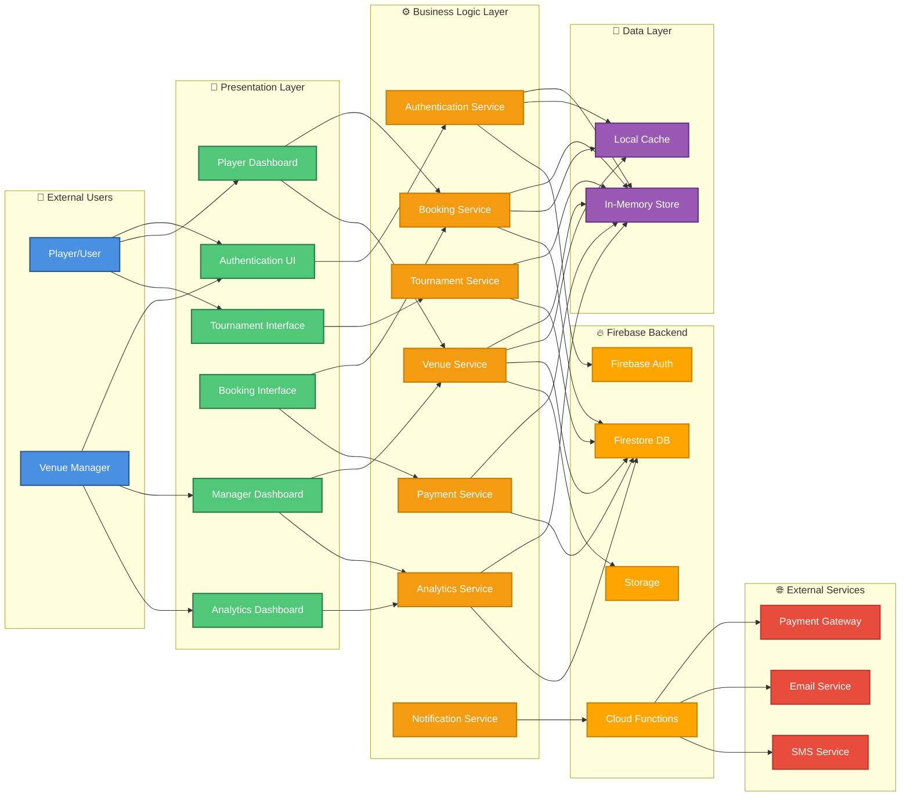
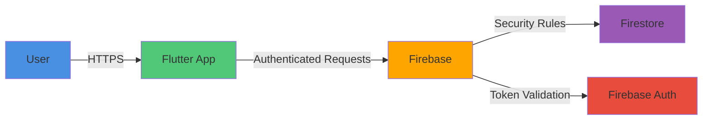
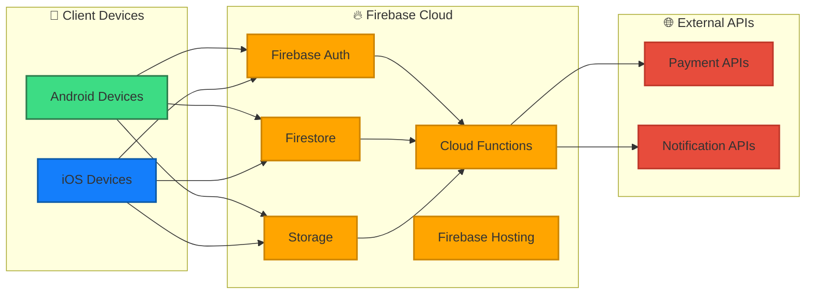

# PlaySphere - System Landscape Diagram

## System Landscape (Mermaid)



## System Components

### 1. External Users
- **Player/User**: End users who book venues and organize tournaments
- **Venue Manager**: Business owners who manage sports facilities

### 2. Presentation Layer (Flutter UI)
- **Authentication UI**: Login, registration, password reset screens
- **Player Dashboard**: Home screen with venue browsing, bookings, tournaments
- **Manager Dashboard**: Venue management, booking overview, analytics
- **Booking Interface**: Venue details, slot selection, payment
- **Tournament Interface**: Tournament creation, fixtures, match results
- **Analytics Dashboard**: Revenue reports, booking trends, performance metrics

### 3. Business Logic Layer (Services)
- **Authentication Service**: User/manager authentication and authorization
- **Booking Service**: Venue booking logic, slot management, conflict detection
- **Venue Service**: Venue CRUD operations, search, filtering
- **Tournament Service**: Tournament lifecycle, fixture generation, points calculation
- **Payment Service**: Payment processing, transaction records
- **Analytics Service**: Data aggregation, report generation
- **Notification Service**: Push notifications, email alerts

### 4. Data Layer
- **In-Memory Data Store (GlobalData)**: Current implementation for rapid prototyping
- **Local Cache**: Offline data persistence, performance optimization

### 5. Firebase Backend
- **Firebase Authentication**: User identity management
- **Cloud Firestore**: NoSQL database for all entities
- **Firebase Storage**: Profile images, venue photos
- **Cloud Functions**: Server-side logic, scheduled tasks

### 6. External Services
- **Payment Gateway**: JazzCash, EasyPaisa integration
- **Email Service**: Booking confirmations, notifications
- **SMS Service**: OTP verification, alerts

## Data Flow Examples

### Booking Flow
```
Player → BookingUI → BookingService → GlobalData/Firestore
                   ↓
              PaymentService → PaymentGateway
                   ↓
           NotificationService → Email/SMS
```

### Tournament Creation Flow
```
Player → TournamentUI → TournamentService → GlobalData/Firestore
                      ↓
                 VenueService (for match bookings)
                      ↓
              NotificationService (team invites)
```

### Analytics Flow
```
Manager → AnalyticsUI → AnalyticsService → Firestore (aggregate queries)
                                         ↓
                                    LocalCache (caching)
```

## Technology Stack

### Frontend
- **Framework**: Flutter 3.x
- **State Management**: Provider pattern
- **UI Components**: Material Design 3
- **Navigation**: Named routes with arguments

### Backend
- **Authentication**: Firebase Auth
- **Database**: Cloud Firestore
- **Storage**: Firebase Storage
- **Functions**: Cloud Functions (Node.js/TypeScript)

### Current Implementation
- **Data Storage**: In-memory GlobalData class
- **Authentication**: Firebase Auth with email/password
- **Payment**: Mock implementation (UI only)

## Security Architecture



### Security Layers
1. **Transport Security**: HTTPS/TLS encryption
2. **Authentication**: Firebase Auth tokens
3. **Authorization**: Firestore security rules
4. **Data Validation**: Client and server-side validation
5. **Role-Based Access**: User vs Manager permissions

## Deployment Architecture



## Integration Points

### 1. Firebase Integration
- Authentication: Email/password, Google Sign-In (future)
- Database: Real-time sync, offline persistence
- Storage: Image upload/download with CDN

### 2. Payment Integration (Planned)
- JazzCash Mobile Account API
- EasyPaisa Merchant API
- Bank transfer verification

### 3. Notification Integration (Planned)
- Firebase Cloud Messaging (FCM)
- Email via SendGrid/Firebase Extensions
- SMS via Twilio/local providers

## Scalability Considerations

### Current State
- In-memory data (development only)
- Single-device state management
- No real-time sync

### Production Ready
- Firestore with proper indexing
- Cloud Functions for heavy operations
- CDN for static assets
- Caching strategy for frequently accessed data

## Future Enhancements

### Phase 1 (Database Migration)
- Migrate from GlobalData to Firestore
- Implement offline persistence
- Add real-time listeners

### Phase 2 (Payment Integration)
- Integrate payment gateways
- Add transaction verification
- Implement refund logic

### Phase 3 (Advanced Features)
- Push notifications
- Chat system
- Review and rating system
- Advanced analytics with ML

### Phase 4 (Scale & Optimize)
- Implement caching layers
- Add search indexing (Algolia)
- Performance monitoring
- Load balancing

---

**Note:** This landscape diagram represents the complete system architecture of PlaySphere, showing how all components interact from user interfaces to backend services and external integrations.
