# PlaySphere - Main Features Activity Diagrams

This document contains activity diagrams for all main features of the PlaySphere sports venue booking application using Mermaid syntax.

---

## Table of Contents
1. [User Authentication Flow](#1-user-authentication-flow)
2. [Player Registration Flow](#2-player-registration-flow)
3. [Manager Registration Flow](#3-manager-registration-flow)
4. [Venue Browsing and Search](#4-venue-browsing-and-search)
5. [Venue Booking Process](#5-venue-booking-process)
6. [Favorites Management](#6-favorites-management)
7. [Tournament Creation](#7-tournament-creation)
8. [Tournament Management](#8-tournament-management)
9. [Manager Dashboard Access](#9-manager-dashboard-access)
10. [Analytics and Reports](#10-analytics-and-reports)
11. [Profile Management](#11-profile-management)
12. [Password Reset Flow](#12-password-reset-flow)

---

## 1. User Authentication Flow

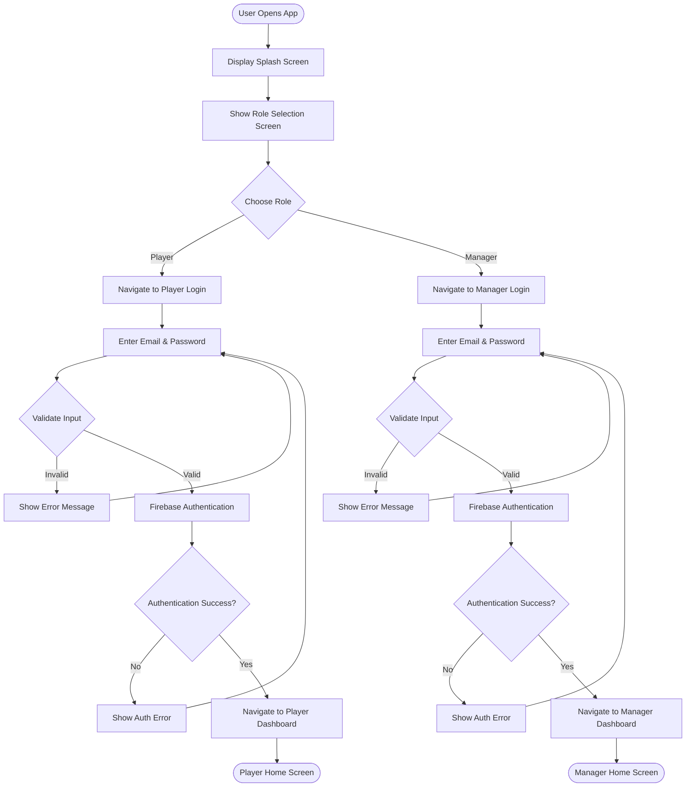

---

## 2. Player Registration Flow

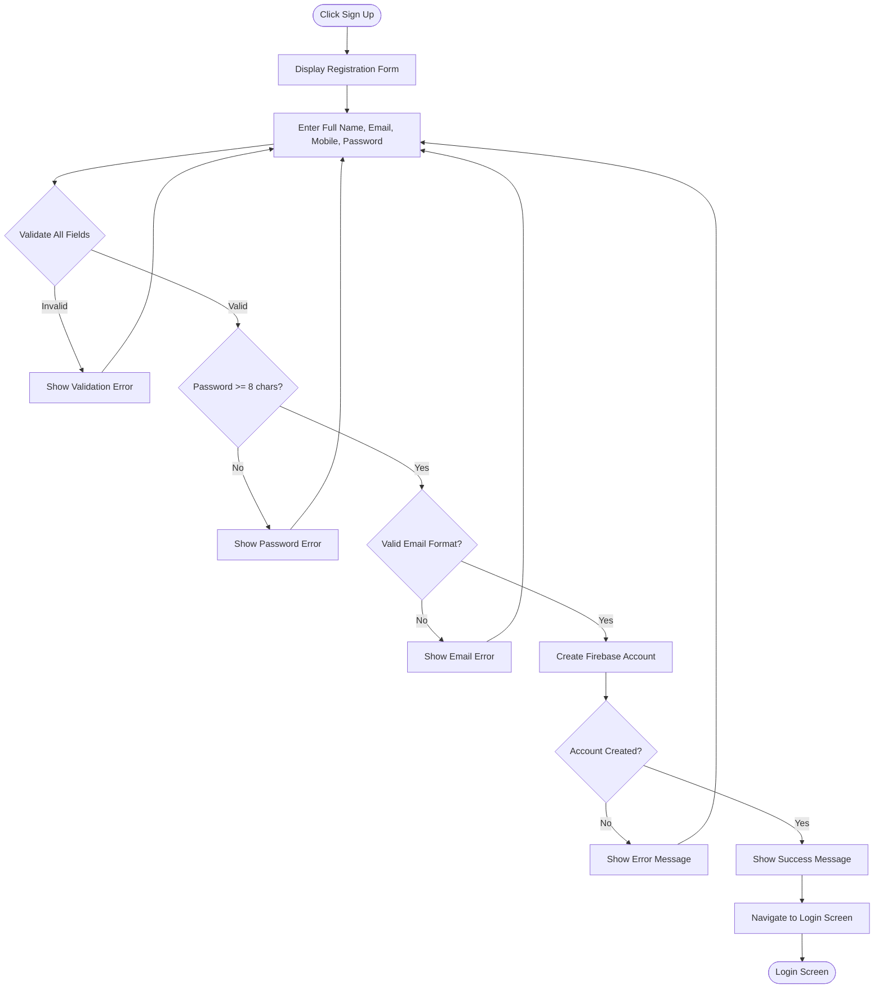

---

## 3. Manager Registration Flow

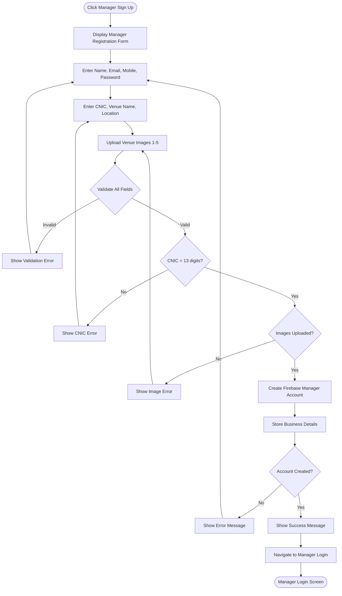

---

## 4. Venue Browsing and Search

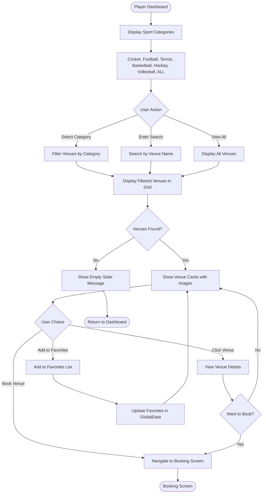

---

## 5. Venue Booking Process

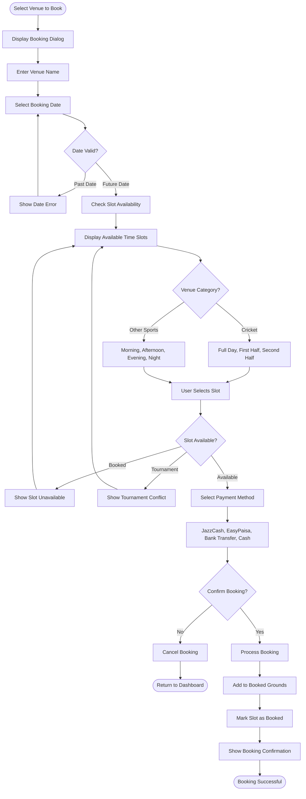

---

## 6. Favorites Management

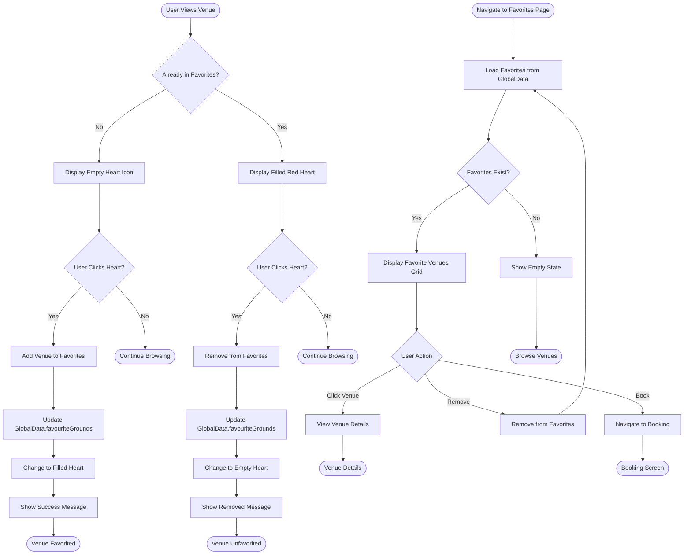

---

## 7. Tournament Creation

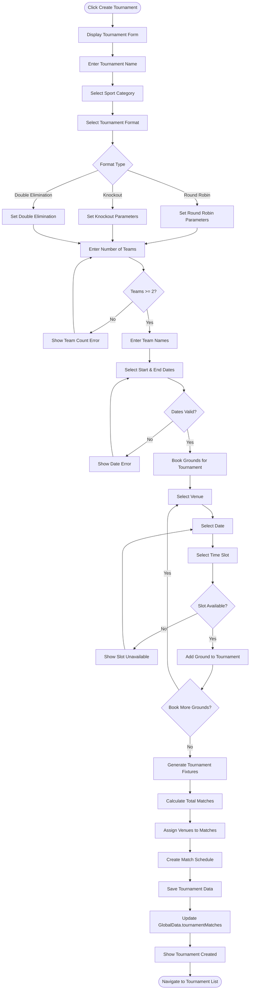

---

## 8. Tournament Management

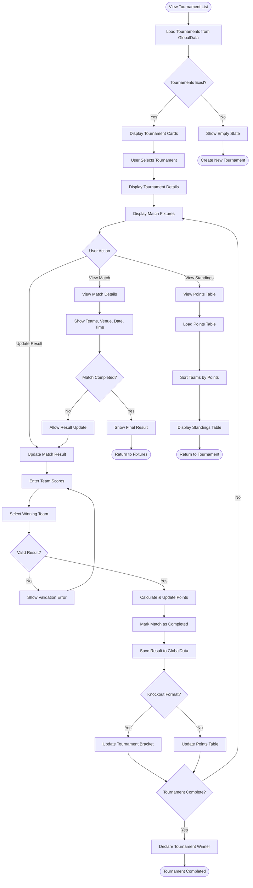

---

## 9. Manager Dashboard Access

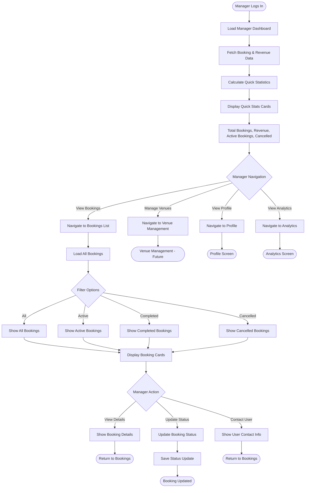

---

## 10. Analytics and Reports

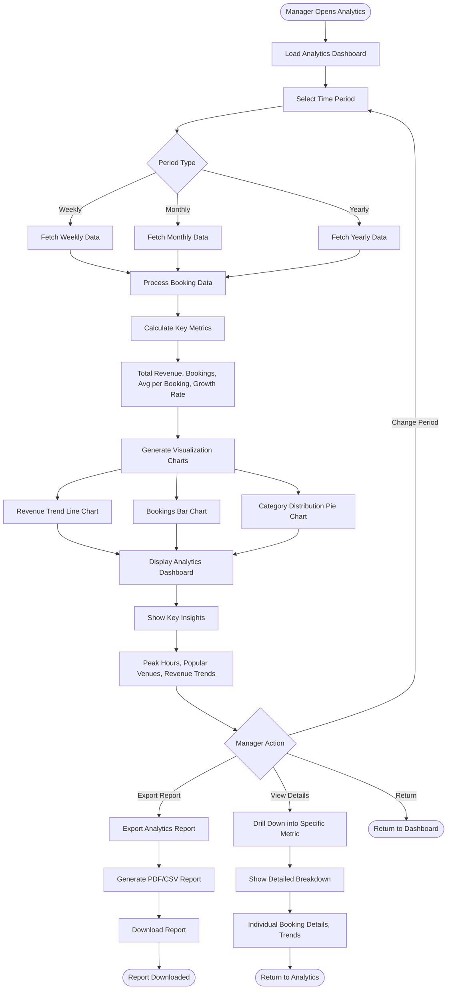

---

## 11. Profile Management

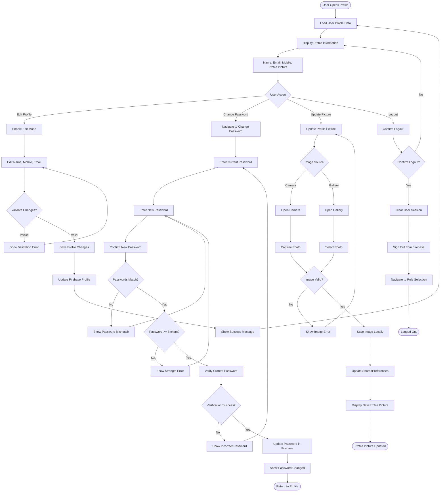

---

## 12. Password Reset Flow

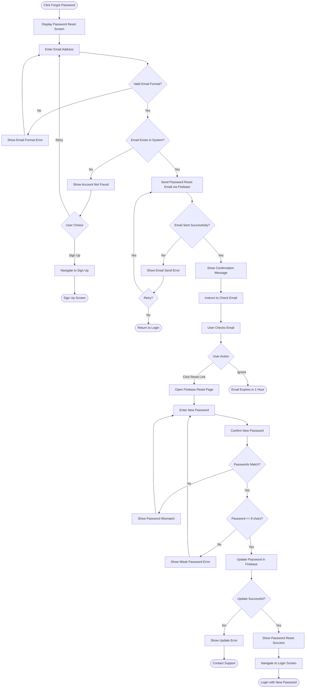

---

## Additional Feature Flows

### 13. Booking History View

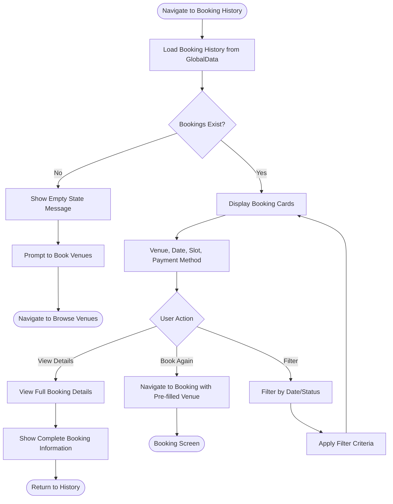

### 14. Notification System (Future)

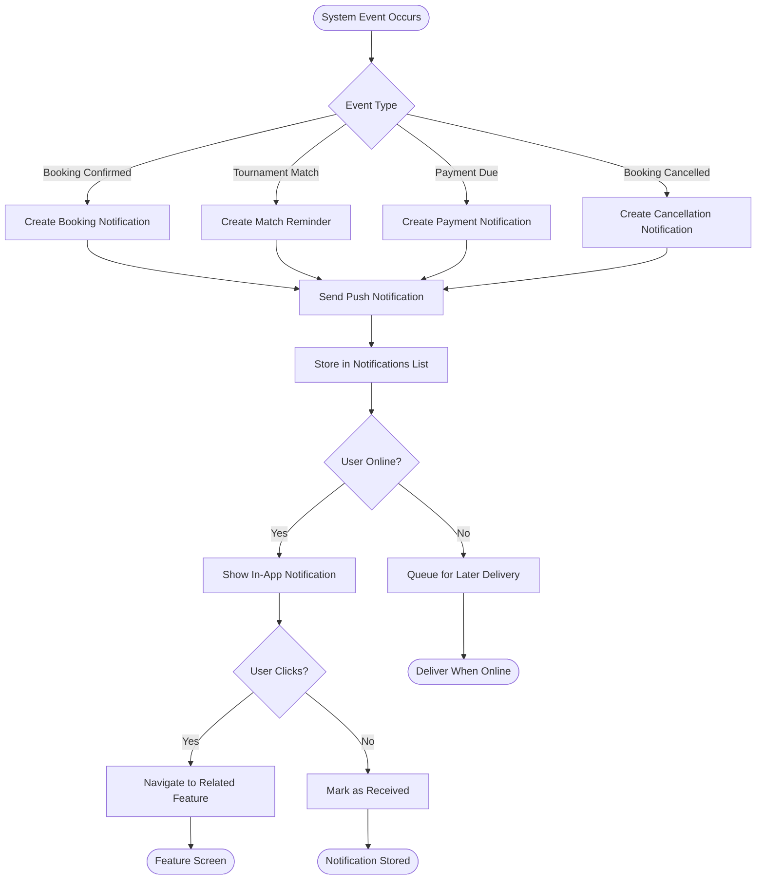

---

## System Overview Activity Diagram

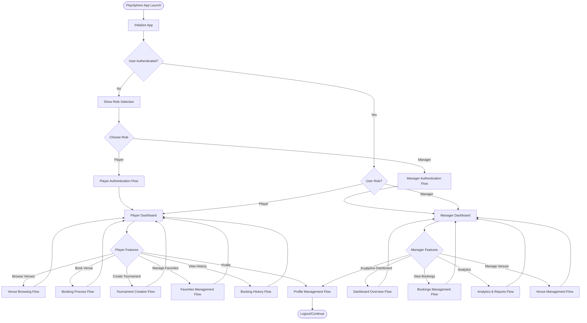

---

## Notes

- All diagrams use Mermaid syntax and can be rendered in any Mermaid-compatible viewer
- Activity diagrams show the complete flow of each major feature
- Decision points are represented with diamond shapes
- Process steps are shown in rectangles
- Start/End points are shown in rounded rectangles
- Arrows indicate the flow direction and sequence

---

**Document Version:** 1.0  
**Last Updated:** December 3, 2024  
**Application:** PlaySphere - Sports Venue Booking System
