# PlaySphere - Main Features Sequence Diagrams

This document contains sequence diagrams for all main features of the PlaySphere sports venue booking application using Mermaid syntax.

---

## Table of Contents
1. [User Authentication & Login](#1-user-authentication--login)
2. [Player Registration](#2-player-registration)
3. [Manager Registration](#3-manager-registration)
4. [Venue Browsing & Search](#4-venue-browsing--search)
5. [Venue Booking Process](#5-venue-booking-process)
6. [Favorites Management](#6-favorites-management)
7. [Tournament Creation](#7-tournament-creation)
8. [Tournament Match Management](#8-tournament-match-management)
9. [Manager Dashboard & Analytics](#9-manager-dashboard--analytics)
10. [Profile Management](#10-profile-management)
11. [Password Reset](#11-password-reset)
12. [Booking History](#12-booking-history)
13. [Manager Booking Management](#13-manager-booking-management)
14. [Manager Revenue Tracking](#14-manager-revenue-tracking)
15. [Manager Venue Availability Management](#15-manager-venue-availability-management)
16. [Manager Tournament Oversight](#17-manager-tournament-oversight)

---

## 1. User Authentication & Login

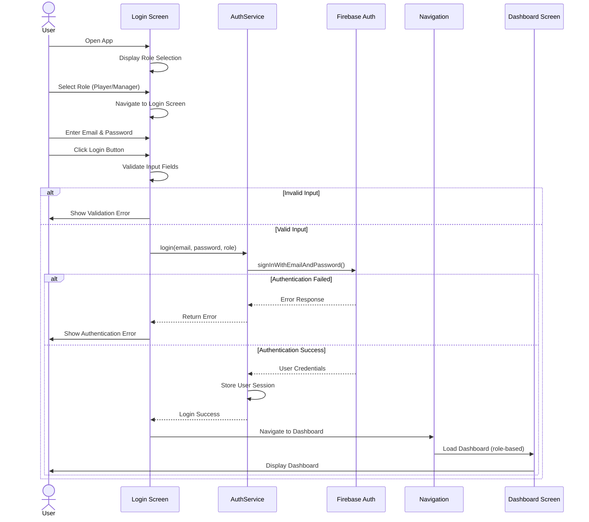
```mermaid
sequenceDiagram
    actor User
    participant UI as Login Screen
    participant Auth as AuthService
    participant Firebase as Firebase Auth
    participant Nav as Navigation
    participant Dashboard as Dashboard Screen

    User->>UI: Open App
    UI->>UI: Display Role Selection
    User->>UI: Select Role (Player/Manager)
    UI->>UI: Navigate to Login Screen
    
    User->>UI: Enter Email & Password
    User->>UI: Click Login Button
    
    UI->>UI: Validate Input Fields
    alt Invalid Input
        UI->>User: Show Validation Error
    else Valid Input
        UI->>Auth: login(email, password, role)
        Auth->>Firebase: signInWithEmailAndPassword()
        
        alt Authentication Failed
            Firebase-->>Auth: Error Response
            Auth-->>UI: Return Error
            UI->>User: Show Authentication Error
        else Authentication Success
            Firebase-->>Auth: User Credentials
            Auth->>Auth: Store User Session
            Auth-->>UI: Login Success
            UI->>Nav: Navigate to Dashboard
            Nav->>Dashboard: Load Dashboard (role-based)
            Dashboard->>User: Display Dashboard
        end
    end
```

---

## 2. Player Registration

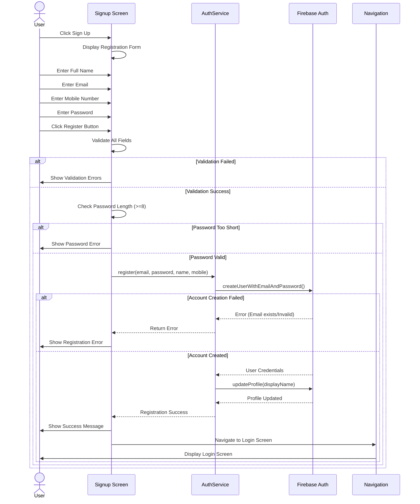
```mermaid
sequenceDiagram
    actor User
    participant UI as Signup Screen
    participant Auth as AuthService
    participant Firebase as Firebase Auth
    participant Nav as Navigation

    User->>UI: Click Sign Up
    UI->>UI: Display Registration Form
    
    User->>UI: Enter Full Name
    User->>UI: Enter Email
    User->>UI: Enter Mobile Number
    User->>UI: Enter Password
    User->>UI: Click Register Button
    
    UI->>UI: Validate All Fields
    alt Validation Failed
        UI->>User: Show Validation Errors
    else Validation Success
        UI->>UI: Check Password Length (>=8)
        alt Password Too Short
            UI->>User: Show Password Error
        else Password Valid
            UI->>Auth: register(email, password, name, mobile)
            Auth->>Firebase: createUserWithEmailAndPassword()
            
            alt Account Creation Failed
                Firebase-->>Auth: Error (Email exists/Invalid)
                Auth-->>UI: Return Error
                UI->>User: Show Registration Error
            else Account Created
                Firebase-->>Auth: User Credentials
                Auth->>Firebase: updateProfile(displayName)
                Firebase-->>Auth: Profile Updated
                Auth-->>UI: Registration Success
                UI->>User: Show Success Message
                UI->>Nav: Navigate to Login Screen
                Nav->>User: Display Login Screen
            end
        end
    end
```

---

## 3. Manager Registration

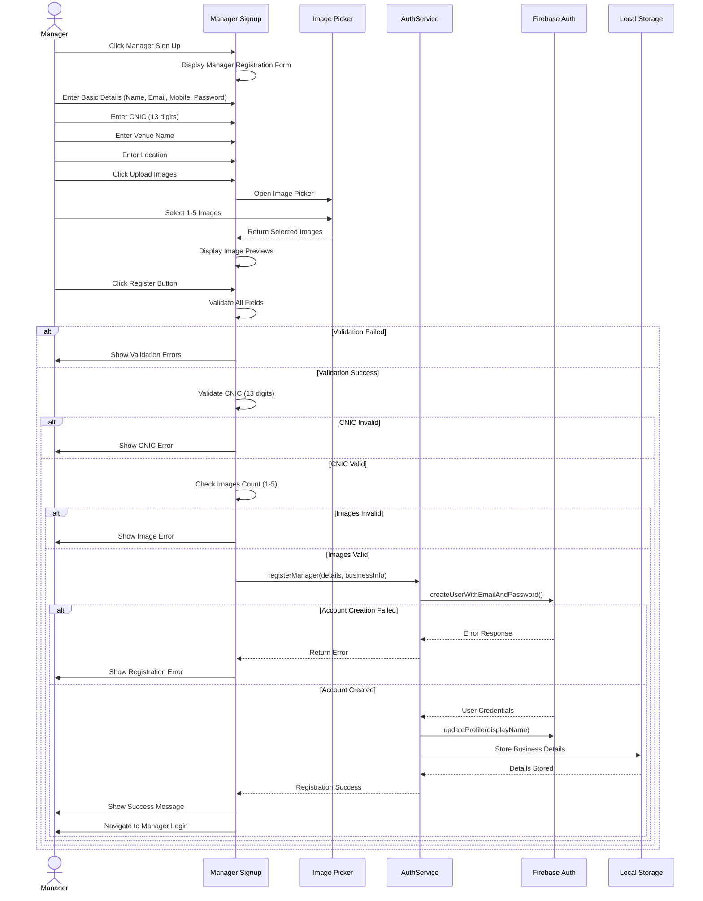
```mermaid
sequenceDiagram
    actor Manager
    participant UI as Manager Signup
    participant ImagePicker as Image Picker
    participant Auth as AuthService
    participant Firebase as Firebase Auth
    participant Storage as Local Storage

    Manager->>UI: Click Manager Sign Up
    UI->>UI: Display Manager Registration Form
    
    Manager->>UI: Enter Basic Details (Name, Email, Mobile, Password)
    Manager->>UI: Enter CNIC (13 digits)
    Manager->>UI: Enter Venue Name
    Manager->>UI: Enter Location
    
    Manager->>UI: Click Upload Images
    UI->>ImagePicker: Open Image Picker
    Manager->>ImagePicker: Select 1-5 Images
    ImagePicker-->>UI: Return Selected Images
    UI->>UI: Display Image Previews
    
    Manager->>UI: Click Register Button
    
    UI->>UI: Validate All Fields
    alt Validation Failed
        UI->>Manager: Show Validation Errors
    else Validation Success
        UI->>UI: Validate CNIC (13 digits)
        alt CNIC Invalid
            UI->>Manager: Show CNIC Error
        else CNIC Valid
            UI->>UI: Check Images Count (1-5)
            alt Images Invalid
                UI->>Manager: Show Image Error
            else Images Valid
                UI->>Auth: registerManager(details, businessInfo)
                Auth->>Firebase: createUserWithEmailAndPassword()
                
                alt Account Creation Failed
                    Firebase-->>Auth: Error Response
                    Auth-->>UI: Return Error
                    UI->>Manager: Show Registration Error
                else Account Created
                    Firebase-->>Auth: User Credentials
                    Auth->>Firebase: updateProfile(displayName)
                    Auth->>Storage: Store Business Details
                    Storage-->>Auth: Details Stored
                    Auth-->>UI: Registration Success
                    UI->>Manager: Show Success Message
                    UI->>Manager: Navigate to Manager Login
                end
            end
        end
    end
```

---

## 4. Venue Browsing & Search

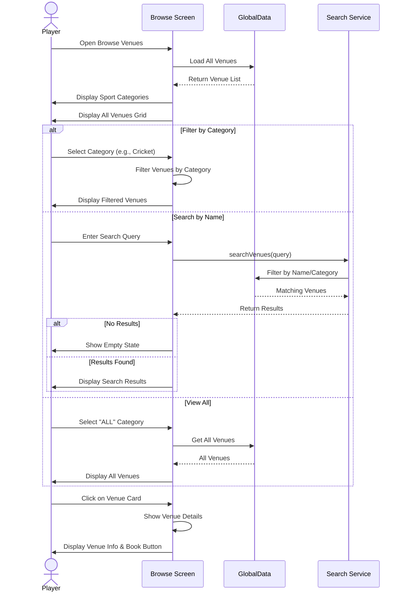
```mermaid
sequenceDiagram
    actor Player
    participant UI as Browse Screen
    participant GlobalData as GlobalData
    participant Search as Search Service

    Player->>UI: Open Browse Venues
    UI->>GlobalData: Load All Venues
    GlobalData-->>UI: Return Venue List
    UI->>Player: Display Sport Categories
    UI->>Player: Display All Venues Grid
    
    alt Filter by Category
        Player->>UI: Select Category (e.g., Cricket)
        UI->>UI: Filter Venues by Category
        UI->>Player: Display Filtered Venues
    else Search by Name
        Player->>UI: Enter Search Query
        UI->>Search: searchVenues(query)
        Search->>GlobalData: Filter by Name/Category
        GlobalData-->>Search: Matching Venues
        Search-->>UI: Return Results
        alt No Results
            UI->>Player: Show Empty State
        else Results Found
            UI->>Player: Display Search Results
        end
    else View All
        Player->>UI: Select "ALL" Category
        UI->>GlobalData: Get All Venues
        GlobalData-->>UI: All Venues
        UI->>Player: Display All Venues
    end
    
    Player->>UI: Click on Venue Card
    UI->>UI: Show Venue Details
    UI->>Player: Display Venue Info & Book Button
```

---

## 5. Venue Booking Process

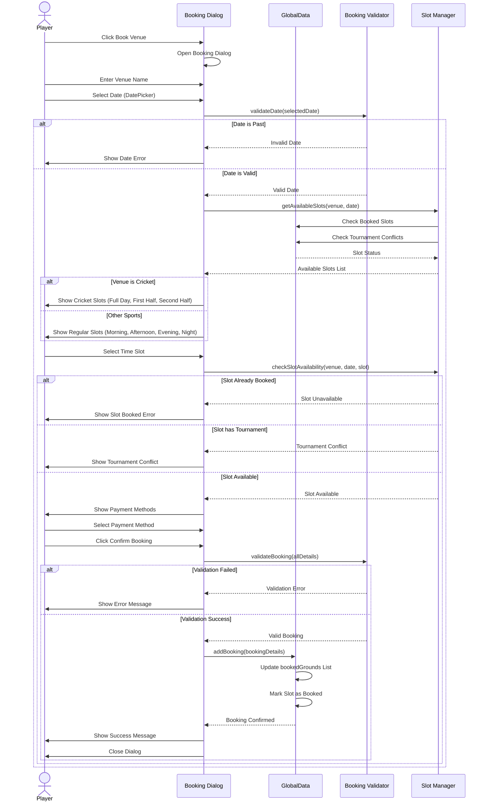
```mermaid
sequenceDiagram
    actor Player
    participant UI as Booking Dialog
    participant GlobalData as GlobalData
    participant Validator as Booking Validator
    participant SlotManager as Slot Manager

    Player->>UI: Click Book Venue
    UI->>UI: Open Booking Dialog
    
    Player->>UI: Enter Venue Name
    Player->>UI: Select Date (DatePicker)
    
    UI->>Validator: validateDate(selectedDate)
    alt Date is Past
        Validator-->>UI: Invalid Date
        UI->>Player: Show Date Error
    else Date is Valid
        Validator-->>UI: Valid Date
        UI->>SlotManager: getAvailableSlots(venue, date)
        SlotManager->>GlobalData: Check Booked Slots
        SlotManager->>GlobalData: Check Tournament Conflicts
        GlobalData-->>SlotManager: Slot Status
        SlotManager-->>UI: Available Slots List
        
        alt Venue is Cricket
            UI->>Player: Show Cricket Slots (Full Day, First Half, Second Half)
        else Other Sports
            UI->>Player: Show Regular Slots (Morning, Afternoon, Evening, Night)
        end
        
        Player->>UI: Select Time Slot
        
        UI->>SlotManager: checkSlotAvailability(venue, date, slot)
        alt Slot Already Booked
            SlotManager-->>UI: Slot Unavailable
            UI->>Player: Show Slot Booked Error
        else Slot has Tournament
            SlotManager-->>UI: Tournament Conflict
            UI->>Player: Show Tournament Conflict
        else Slot Available
            SlotManager-->>UI: Slot Available
            UI->>Player: Show Payment Methods
            
            Player->>UI: Select Payment Method
            Player->>UI: Click Confirm Booking
            
            UI->>Validator: validateBooking(allDetails)
            alt Validation Failed
                Validator-->>UI: Validation Error
                UI->>Player: Show Error Message
            else Validation Success
                Validator-->>UI: Valid Booking
                UI->>GlobalData: addBooking(bookingDetails)
                GlobalData->>GlobalData: Update bookedGrounds List
                GlobalData->>GlobalData: Mark Slot as Booked
                GlobalData-->>UI: Booking Confirmed
                UI->>Player: Show Success Message
                UI->>Player: Close Dialog
            end
        end
    end
```

---

## 6. Favorites Management

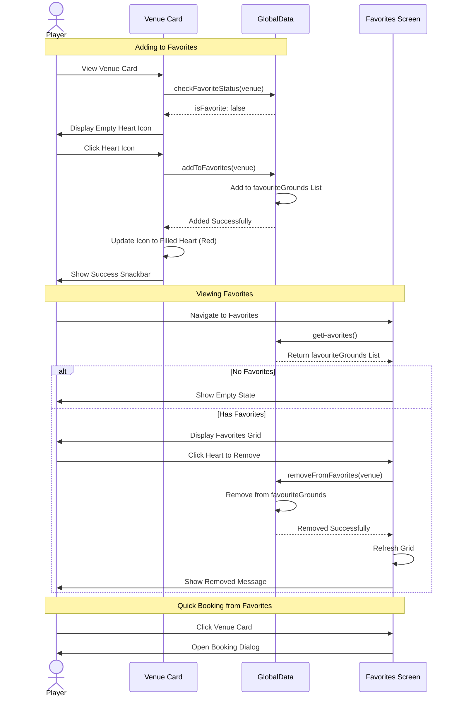
```mermaid
sequenceDiagram
    actor Player
    participant UI as Venue Card
    participant GlobalData as GlobalData
    participant FavScreen as Favorites Screen

    Note over Player,GlobalData: Adding to Favorites
    Player->>UI: View Venue Card
    UI->>GlobalData: checkFavoriteStatus(venue)
    GlobalData-->>UI: isFavorite: false
    UI->>Player: Display Empty Heart Icon
    
    Player->>UI: Click Heart Icon
    UI->>GlobalData: addToFavorites(venue)
    GlobalData->>GlobalData: Add to favouriteGrounds List
    GlobalData-->>UI: Added Successfully
    UI->>UI: Update Icon to Filled Heart (Red)
    UI->>Player: Show Success Snackbar
    
    Note over Player,FavScreen: Viewing Favorites
    Player->>FavScreen: Navigate to Favorites
    FavScreen->>GlobalData: getFavorites()
    GlobalData-->>FavScreen: Return favouriteGrounds List
    
    alt No Favorites
        FavScreen->>Player: Show Empty State
    else Has Favorites
        FavScreen->>Player: Display Favorites Grid
        
        Player->>FavScreen: Click Heart to Remove
        FavScreen->>GlobalData: removeFromFavorites(venue)
        GlobalData->>GlobalData: Remove from favouriteGrounds
        GlobalData-->>FavScreen: Removed Successfully
        FavScreen->>FavScreen: Refresh Grid
        FavScreen->>Player: Show Removed Message
    end
    
    Note over Player,FavScreen: Quick Booking from Favorites
    Player->>FavScreen: Click Venue Card
    FavScreen->>Player: Open Booking Dialog
```

---

## 7. Tournament Creation

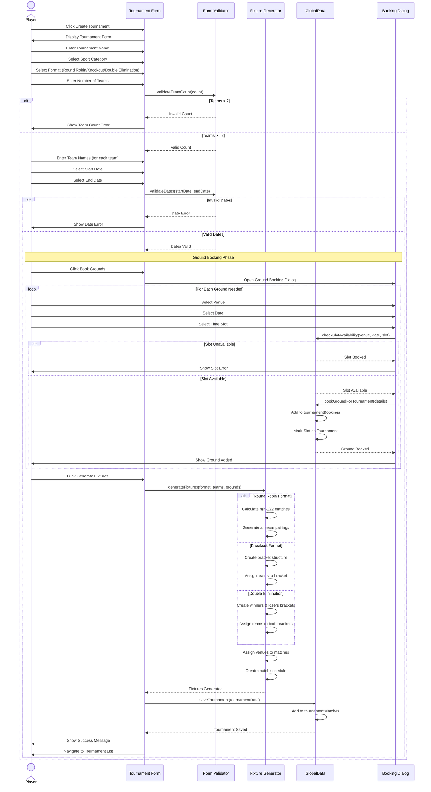
```mermaid
sequenceDiagram
    actor Player
    participant UI as Tournament Form
    participant Validator as Form Validator
    participant FixtureGen as Fixture Generator
    participant GlobalData as GlobalData
    participant BookingUI as Booking Dialog

    Player->>UI: Click Create Tournament
    UI->>Player: Display Tournament Form
    
    Player->>UI: Enter Tournament Name
    Player->>UI: Select Sport Category
    Player->>UI: Select Format (Round Robin/Knockout/Double Elimination)
    Player->>UI: Enter Number of Teams
    
    UI->>Validator: validateTeamCount(count)
    alt Teams < 2
        Validator-->>UI: Invalid Count
        UI->>Player: Show Team Count Error
    else Teams >= 2
        Validator-->>UI: Valid Count
        Player->>UI: Enter Team Names (for each team)
        Player->>UI: Select Start Date
        Player->>UI: Select End Date
        
        UI->>Validator: validateDates(startDate, endDate)
        alt Invalid Dates
            Validator-->>UI: Date Error
            UI->>Player: Show Date Error
        else Valid Dates
            Validator-->>UI: Dates Valid
            
            Note over Player,BookingUI: Ground Booking Phase
            Player->>UI: Click Book Grounds
            UI->>BookingUI: Open Ground Booking Dialog
            
            loop For Each Ground Needed
                Player->>BookingUI: Select Venue
                Player->>BookingUI: Select Date
                Player->>BookingUI: Select Time Slot
                
                BookingUI->>GlobalData: checkSlotAvailability(venue, date, slot)
                alt Slot Unavailable
                    GlobalData-->>BookingUI: Slot Booked
                    BookingUI->>Player: Show Slot Error
                else Slot Available
                    GlobalData-->>BookingUI: Slot Available
                    BookingUI->>GlobalData: bookGroundForTournament(details)
                    GlobalData->>GlobalData: Add to tournamentBookings
                    GlobalData->>GlobalData: Mark Slot as Tournament
                    GlobalData-->>BookingUI: Ground Booked
                    BookingUI->>Player: Show Ground Added
                end
            end
            
            Player->>UI: Click Generate Fixtures
            
            UI->>FixtureGen: generateFixtures(format, teams, grounds)
            
            alt Round Robin Format
                FixtureGen->>FixtureGen: Calculate n(n-1)/2 matches
                FixtureGen->>FixtureGen: Generate all team pairings
            else Knockout Format
                FixtureGen->>FixtureGen: Create bracket structure
                FixtureGen->>FixtureGen: Assign teams to bracket
            else Double Elimination
                FixtureGen->>FixtureGen: Create winners & losers brackets
                FixtureGen->>FixtureGen: Assign teams to both brackets
            end
            
            FixtureGen->>FixtureGen: Assign venues to matches
            FixtureGen->>FixtureGen: Create match schedule
            FixtureGen-->>UI: Fixtures Generated
            
            UI->>GlobalData: saveTournament(tournamentData)
            GlobalData->>GlobalData: Add to tournamentMatches
            GlobalData-->>UI: Tournament Saved
            
            UI->>Player: Show Success Message
            UI->>Player: Navigate to Tournament List
        end
    end
```

---

## 8. Tournament Match Management

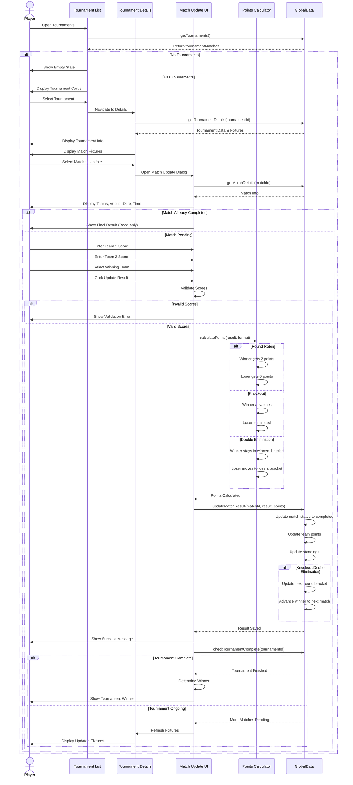
```mermaid
sequenceDiagram
    actor Player
    participant TournList as Tournament List
    participant TournDetail as Tournament Details
    participant MatchUI as Match Update UI
    participant PointsCalc as Points Calculator
    participant GlobalData as GlobalData

    Player->>TournList: Open Tournaments
    TournList->>GlobalData: getTournaments()
    GlobalData-->>TournList: Return tournamentMatches
    
    alt No Tournaments
        TournList->>Player: Show Empty State
    else Has Tournaments
        TournList->>Player: Display Tournament Cards
        
        Player->>TournList: Select Tournament
        TournList->>TournDetail: Navigate to Details
        TournDetail->>GlobalData: getTournamentDetails(tournamentId)
        GlobalData-->>TournDetail: Tournament Data & Fixtures
        TournDetail->>Player: Display Tournament Info
        TournDetail->>Player: Display Match Fixtures
        
        Player->>TournDetail: Select Match to Update
        TournDetail->>MatchUI: Open Match Update Dialog
        
        MatchUI->>GlobalData: getMatchDetails(matchId)
        GlobalData-->>MatchUI: Match Info
        MatchUI->>Player: Display Teams, Venue, Date, Time
        
        alt Match Already Completed
            MatchUI->>Player: Show Final Result (Read-only)
        else Match Pending
            Player->>MatchUI: Enter Team 1 Score
            Player->>MatchUI: Enter Team 2 Score
            Player->>MatchUI: Select Winning Team
            Player->>MatchUI: Click Update Result
            
            MatchUI->>MatchUI: Validate Scores
            alt Invalid Scores
                MatchUI->>Player: Show Validation Error
            else Valid Scores
                MatchUI->>PointsCalc: calculatePoints(result, format)
                
                alt Round Robin
                    PointsCalc->>PointsCalc: Winner gets 2 points
                    PointsCalc->>PointsCalc: Loser gets 0 points
                else Knockout
                    PointsCalc->>PointsCalc: Winner advances
                    PointsCalc->>PointsCalc: Loser eliminated
                else Double Elimination
                    PointsCalc->>PointsCalc: Winner stays in winners bracket
                    PointsCalc->>PointsCalc: Loser moves to losers bracket
                end
                
                PointsCalc-->>MatchUI: Points Calculated
                
                MatchUI->>GlobalData: updateMatchResult(matchId, result, points)
                GlobalData->>GlobalData: Update match status to completed
                GlobalData->>GlobalData: Update team points
                GlobalData->>GlobalData: Update standings
                
                alt Knockout/Double Elimination
                    GlobalData->>GlobalData: Update next round bracket
                    GlobalData->>GlobalData: Advance winner to next match
                end
                
                GlobalData-->>MatchUI: Result Saved
                MatchUI->>Player: Show Success Message
                
                MatchUI->>GlobalData: checkTournamentComplete(tournamentId)
                alt Tournament Complete
                    GlobalData-->>MatchUI: Tournament Finished
                    MatchUI->>MatchUI: Determine Winner
                    MatchUI->>Player: Show Tournament Winner
                else Tournament Ongoing
                    GlobalData-->>MatchUI: More Matches Pending
                    MatchUI->>TournDetail: Refresh Fixtures
                    TournDetail->>Player: Display Updated Fixtures
                end
            end
        end
    end
```

---

## 9. Manager Dashboard & Analytics

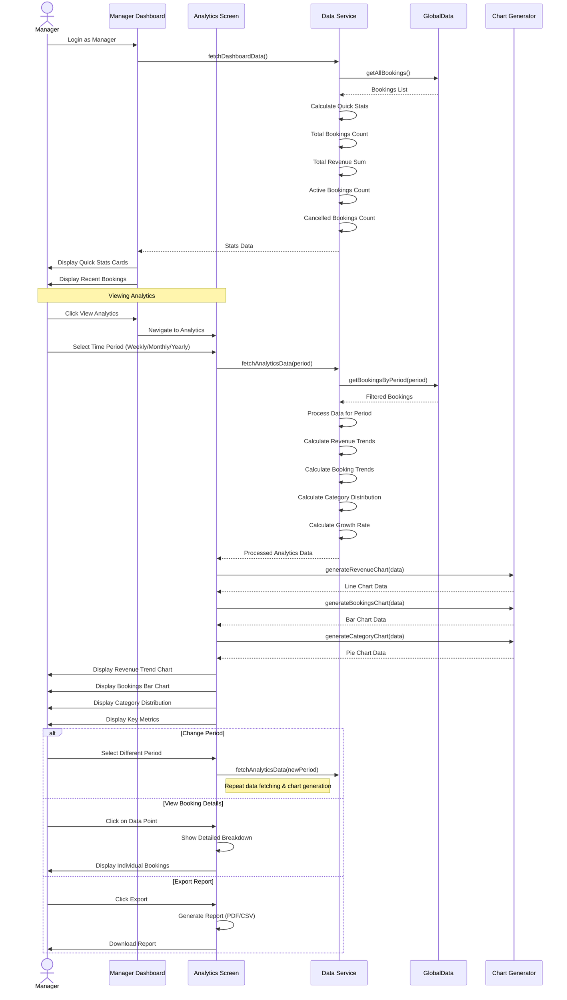
```mermaid
sequenceDiagram
    actor Manager
    participant Dashboard as Manager Dashboard
    participant Analytics as Analytics Screen
    participant DataService as Data Service
    participant GlobalData as GlobalData
    participant ChartGen as Chart Generator

    Manager->>Dashboard: Login as Manager
    Dashboard->>DataService: fetchDashboardData()
    DataService->>GlobalData: getAllBookings()
    GlobalData-->>DataService: Bookings List
    
    DataService->>DataService: Calculate Quick Stats
    DataService->>DataService: Total Bookings Count
    DataService->>DataService: Total Revenue Sum
    DataService->>DataService: Active Bookings Count
    DataService->>DataService: Cancelled Bookings Count
    DataService-->>Dashboard: Stats Data
    
    Dashboard->>Manager: Display Quick Stats Cards
    Dashboard->>Manager: Display Recent Bookings
    
    Note over Manager,Analytics: Viewing Analytics
    Manager->>Dashboard: Click View Analytics
    Dashboard->>Analytics: Navigate to Analytics
    
    Manager->>Analytics: Select Time Period (Weekly/Monthly/Yearly)
    Analytics->>DataService: fetchAnalyticsData(period)
    DataService->>GlobalData: getBookingsByPeriod(period)
    GlobalData-->>DataService: Filtered Bookings
    
    DataService->>DataService: Process Data for Period
    DataService->>DataService: Calculate Revenue Trends
    DataService->>DataService: Calculate Booking Trends
    DataService->>DataService: Calculate Category Distribution
    DataService->>DataService: Calculate Growth Rate
    DataService-->>Analytics: Processed Analytics Data
    
    Analytics->>ChartGen: generateRevenueChart(data)
    ChartGen-->>Analytics: Line Chart Data
    
    Analytics->>ChartGen: generateBookingsChart(data)
    ChartGen-->>Analytics: Bar Chart Data
    
    Analytics->>ChartGen: generateCategoryChart(data)
    ChartGen-->>Analytics: Pie Chart Data
    
    Analytics->>Manager: Display Revenue Trend Chart
    Analytics->>Manager: Display Bookings Bar Chart
    Analytics->>Manager: Display Category Distribution
    Analytics->>Manager: Display Key Metrics
    
    alt Change Period
        Manager->>Analytics: Select Different Period
        Analytics->>DataService: fetchAnalyticsData(newPeriod)
        Note right of Analytics: Repeat data fetching & chart generation
    else View Booking Details
        Manager->>Analytics: Click on Data Point
        Analytics->>Analytics: Show Detailed Breakdown
        Analytics->>Manager: Display Individual Bookings
    else Export Report
        Manager->>Analytics: Click Export
        Analytics->>Analytics: Generate Report (PDF/CSV)
        Analytics->>Manager: Download Report
    end
```

---

## 10. Profile Management

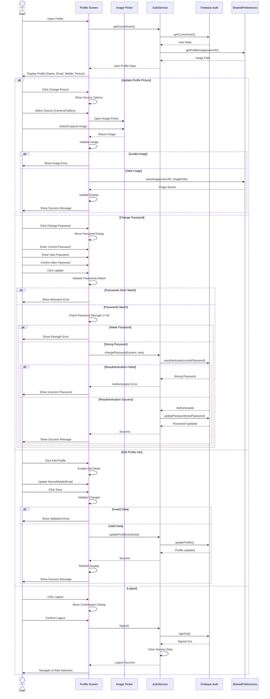
```mermaid
sequenceDiagram
    actor User
    participant ProfileUI as Profile Screen
    participant ImagePicker as Image Picker
    participant Auth as AuthService
    participant Firebase as Firebase Auth
    participant Storage as SharedPreferences

    User->>ProfileUI: Open Profile
    ProfileUI->>Auth: getCurrentUser()
    Auth->>Firebase: getCurrentUser()
    Firebase-->>Auth: User Data
    Auth->>Storage: getProfileImage(userUID)
    Storage-->>Auth: Image Path
    Auth-->>ProfileUI: User Profile Data
    ProfileUI->>User: Display Profile (Name, Email, Mobile, Picture)
    
    alt Update Profile Picture
        User->>ProfileUI: Click Change Picture
        ProfileUI->>ProfileUI: Show Source Options
        
        User->>ProfileUI: Select Source (Camera/Gallery)
        ProfileUI->>ImagePicker: Open Image Picker
        User->>ImagePicker: Select/Capture Image
        ImagePicker-->>ProfileUI: Return Image
        
        ProfileUI->>ProfileUI: Validate Image
        alt Invalid Image
            ProfileUI->>User: Show Image Error
        else Valid Image
            ProfileUI->>Storage: saveImage(userUID, imagePath)
            Storage-->>ProfileUI: Image Saved
            ProfileUI->>ProfileUI: Update Display
            ProfileUI->>User: Show Success Message
        end
        
    else Change Password
        User->>ProfileUI: Click Change Password
        ProfileUI->>ProfileUI: Show Password Dialog
        
        User->>ProfileUI: Enter Current Password
        User->>ProfileUI: Enter New Password
        User->>ProfileUI: Confirm New Password
        User->>ProfileUI: Click Update
        
        ProfileUI->>ProfileUI: Validate Passwords Match
        alt Passwords Don't Match
            ProfileUI->>User: Show Mismatch Error
        else Passwords Match
            ProfileUI->>ProfileUI: Check Password Strength (>=8)
            alt Weak Password
                ProfileUI->>User: Show Strength Error
            else Strong Password
                ProfileUI->>Auth: changePassword(current, new)
                Auth->>Firebase: reauthenticate(currentPassword)
                
                alt Reauthentication Failed
                    Firebase-->>Auth: Wrong Password
                    Auth-->>ProfileUI: Authentication Error
                    ProfileUI->>User: Show Incorrect Password
                else Reauthentication Success
                    Firebase-->>Auth: Authenticated
                    Auth->>Firebase: updatePassword(newPassword)
                    Firebase-->>Auth: Password Updated
                    Auth-->>ProfileUI: Success
                    ProfileUI->>User: Show Success Message
                end
            end
        end
        
    else Edit Profile Info
        User->>ProfileUI: Click Edit Profile
        ProfileUI->>ProfileUI: Enable Edit Mode
        
        User->>ProfileUI: Update Name/Mobile/Email
        User->>ProfileUI: Click Save
        
        ProfileUI->>ProfileUI: Validate Changes
        alt Invalid Data
            ProfileUI->>User: Show Validation Error
        else Valid Data
            ProfileUI->>Auth: updateProfile(newData)
            Auth->>Firebase: updateProfile()
            Firebase-->>Auth: Profile Updated
            Auth-->>ProfileUI: Success
            ProfileUI->>ProfileUI: Refresh Display
            ProfileUI->>User: Show Success Message
        end
        
    else Logout
        User->>ProfileUI: Click Logout
        ProfileUI->>ProfileUI: Show Confirmation Dialog
        User->>ProfileUI: Confirm Logout
        ProfileUI->>Auth: logout()
        Auth->>Firebase: signOut()
        Firebase-->>Auth: Signed Out
        Auth->>Auth: Clear Session Data
        Auth-->>ProfileUI: Logout Success
        ProfileUI->>User: Navigate to Role Selection
    end
```

---

## 11. Password Reset

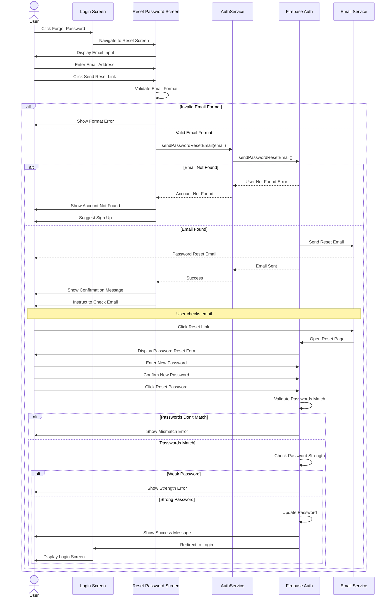
```mermaid
sequenceDiagram
    actor User
    participant LoginUI as Login Screen
    participant ResetUI as Reset Password Screen
    participant Auth as AuthService
    participant Firebase as Firebase Auth
    participant Email as Email Service

    User->>LoginUI: Click Forgot Password
    LoginUI->>ResetUI: Navigate to Reset Screen
    ResetUI->>User: Display Email Input
    
    User->>ResetUI: Enter Email Address
    User->>ResetUI: Click Send Reset Link
    
    ResetUI->>ResetUI: Validate Email Format
    alt Invalid Email Format
        ResetUI->>User: Show Format Error
    else Valid Email Format
        ResetUI->>Auth: sendPasswordResetEmail(email)
        Auth->>Firebase: sendPasswordResetEmail()
        
        alt Email Not Found
            Firebase-->>Auth: User Not Found Error
            Auth-->>ResetUI: Account Not Found
            ResetUI->>User: Show Account Not Found
            ResetUI->>User: Suggest Sign Up
        else Email Found
            Firebase->>Email: Send Reset Email
            Email-->>User: Password Reset Email
            Firebase-->>Auth: Email Sent
            Auth-->>ResetUI: Success
            ResetUI->>User: Show Confirmation Message
            ResetUI->>User: Instruct to Check Email
            
            Note over User,Email: User checks email
            User->>Email: Click Reset Link
            Email->>Firebase: Open Reset Page
            Firebase->>User: Display Password Reset Form
            
            User->>Firebase: Enter New Password
            User->>Firebase: Confirm New Password
            User->>Firebase: Click Reset Password
            
            Firebase->>Firebase: Validate Passwords Match
            alt Passwords Don't Match
                Firebase->>User: Show Mismatch Error
            else Passwords Match
                Firebase->>Firebase: Check Password Strength
                alt Weak Password
                    Firebase->>User: Show Strength Error
                else Strong Password
                    Firebase->>Firebase: Update Password
                    Firebase->>User: Show Success Message
                    Firebase->>LoginUI: Redirect to Login
                    LoginUI->>User: Display Login Screen
                end
            end
        end
    end
```

---

## 12. Booking History

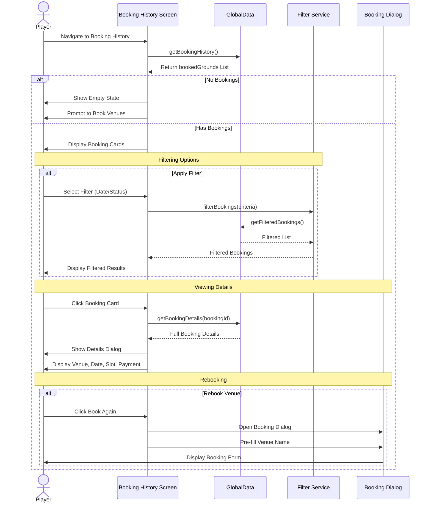
```mermaid
sequenceDiagram
    actor Player
    participant HistoryUI as Booking History Screen
    participant GlobalData as GlobalData
    participant FilterService as Filter Service
    participant BookingUI as Booking Dialog

    Player->>HistoryUI: Navigate to Booking History
    HistoryUI->>GlobalData: getBookingHistory()
    GlobalData-->>HistoryUI: Return bookedGrounds List
    
    alt No Bookings
        HistoryUI->>Player: Show Empty State
        HistoryUI->>Player: Prompt to Book Venues
    else Has Bookings
        HistoryUI->>Player: Display Booking Cards
        
        Note over Player,FilterService: Filtering Options
        alt Apply Filter
            Player->>HistoryUI: Select Filter (Date/Status)
            HistoryUI->>FilterService: filterBookings(criteria)
            FilterService->>GlobalData: getFilteredBookings()
            GlobalData-->>FilterService: Filtered List
            FilterService-->>HistoryUI: Filtered Bookings
            HistoryUI->>Player: Display Filtered Results
        end
        
        Note over Player,BookingUI: Viewing Details
        Player->>HistoryUI: Click Booking Card
        HistoryUI->>GlobalData: getBookingDetails(bookingId)
        GlobalData-->>HistoryUI: Full Booking Details
        HistoryUI->>Player: Show Details Dialog
        HistoryUI->>Player: Display Venue, Date, Slot, Payment
        
        Note over Player,BookingUI: Rebooking
        alt Rebook Venue
            Player->>HistoryUI: Click Book Again
            HistoryUI->>BookingUI: Open Booking Dialog
            HistoryUI->>BookingUI: Pre-fill Venue Name
            BookingUI->>Player: Display Booking Form
        end
    end
```

---

## 13. Manager Booking Management

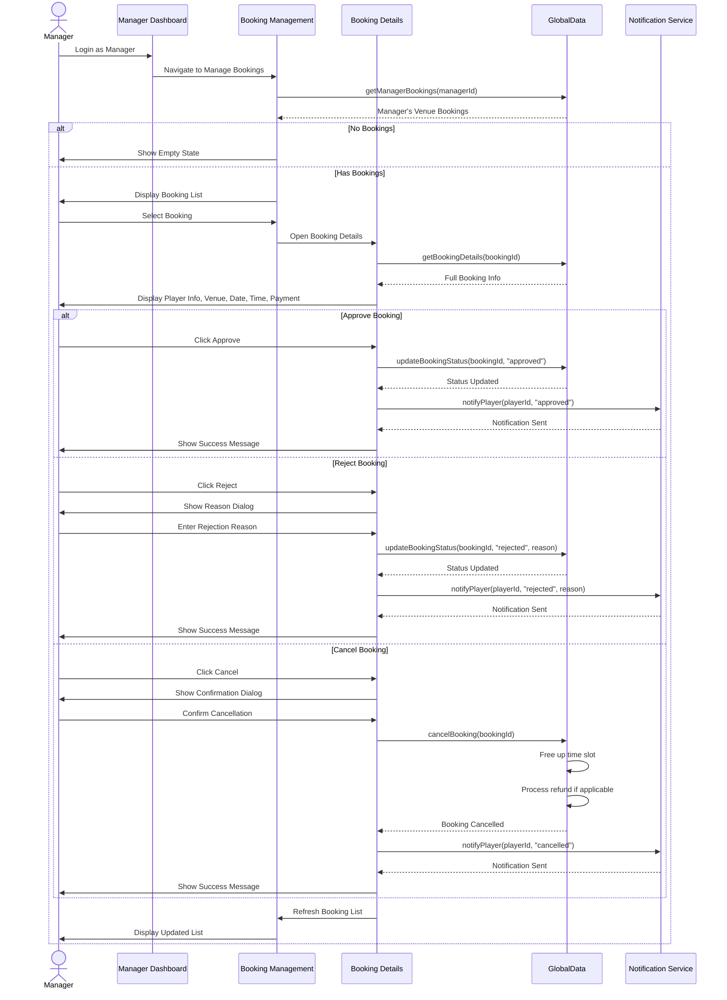
```mermaid
sequenceDiagram
    actor Manager
    participant Dashboard as Manager Dashboard
    participant BookingList as Booking Management
    participant BookingDetail as Booking Details
    participant GlobalData as GlobalData
    participant NotificationService as Notification Service

    Manager->>Dashboard: Login as Manager
    Dashboard->>BookingList: Navigate to Manage Bookings
    BookingList->>GlobalData: getManagerBookings(managerId)
    GlobalData-->>BookingList: Manager's Venue Bookings
    
    alt No Bookings
        BookingList->>Manager: Show Empty State
    else Has Bookings
        BookingList->>Manager: Display Booking List
        
        Manager->>BookingList: Select Booking
        BookingList->>BookingDetail: Open Booking Details
        BookingDetail->>GlobalData: getBookingDetails(bookingId)
        GlobalData-->>BookingDetail: Full Booking Info
        BookingDetail->>Manager: Display Player Info, Venue, Date, Time, Payment
        
        alt Approve Booking
            Manager->>BookingDetail: Click Approve
            BookingDetail->>GlobalData: updateBookingStatus(bookingId, "approved")
            GlobalData-->>BookingDetail: Status Updated
            BookingDetail->>NotificationService: notifyPlayer(playerId, "approved")
            NotificationService-->>BookingDetail: Notification Sent
            BookingDetail->>Manager: Show Success Message
            
        else Reject Booking
            Manager->>BookingDetail: Click Reject
            BookingDetail->>Manager: Show Reason Dialog
            Manager->>BookingDetail: Enter Rejection Reason
            BookingDetail->>GlobalData: updateBookingStatus(bookingId, "rejected", reason)
            GlobalData-->>BookingDetail: Status Updated
            BookingDetail->>NotificationService: notifyPlayer(playerId, "rejected", reason)
            NotificationService-->>BookingDetail: Notification Sent
            BookingDetail->>Manager: Show Success Message
            
        else Cancel Booking
            Manager->>BookingDetail: Click Cancel
            BookingDetail->>Manager: Show Confirmation Dialog
            Manager->>BookingDetail: Confirm Cancellation
            BookingDetail->>GlobalData: cancelBooking(bookingId)
            GlobalData->>GlobalData: Free up time slot
            GlobalData->>GlobalData: Process refund if applicable
            GlobalData-->>BookingDetail: Booking Cancelled
            BookingDetail->>NotificationService: notifyPlayer(playerId, "cancelled")
            NotificationService-->>BookingDetail: Notification Sent
            BookingDetail->>Manager: Show Success Message
        end
        
        BookingDetail->>BookingList: Refresh Booking List
        BookingList->>Manager: Display Updated List
    end
```

---

## 14. Manager Revenue Tracking

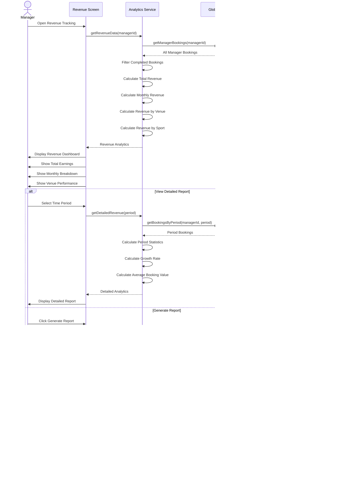
```mermaid
sequenceDiagram
    actor Manager
    participant RevenueUI as Revenue Screen
    participant Analytics as Analytics Service
    participant GlobalData as GlobalData
    participant ReportGen as Report Generator
    participant PaymentService as Payment Service

    Manager->>RevenueUI: Open Revenue Tracking
    RevenueUI->>Analytics: getRevenueData(managerId)
    Analytics->>GlobalData: getManagerBookings(managerId)
    GlobalData-->>Analytics: All Manager Bookings
    
    Analytics->>Analytics: Filter Completed Bookings
    Analytics->>Analytics: Calculate Total Revenue
    Analytics->>Analytics: Calculate Monthly Revenue
    Analytics->>Analytics: Calculate Revenue by Venue
    Analytics->>Analytics: Calculate Revenue by Sport
    Analytics-->>RevenueUI: Revenue Analytics
    
    RevenueUI->>Manager: Display Revenue Dashboard
    RevenueUI->>Manager: Show Total Earnings
    RevenueUI->>Manager: Show Monthly Breakdown
    RevenueUI->>Manager: Show Venue Performance
    
    alt View Detailed Report
        Manager->>RevenueUI: Select Time Period
        RevenueUI->>Analytics: getDetailedRevenue(period)
        Analytics->>GlobalData: getBookingsByPeriod(managerId, period)
        GlobalData-->>Analytics: Period Bookings
        
        Analytics->>Analytics: Calculate Period Statistics
        Analytics->>Analytics: Calculate Growth Rate
        Analytics->>Analytics: Calculate Average Booking Value
        Analytics-->>RevenueUI: Detailed Analytics
        
        RevenueUI->>Manager: Display Detailed Report
        
    else Generate Report
        Manager->>RevenueUI: Click Generate Report
        RevenueUI->>ReportGen: createRevenueReport(data, format)
        ReportGen->>ReportGen: Format Data (PDF/Excel)
        ReportGen->>ReportGen: Add Charts and Graphs
        ReportGen-->>RevenueUI: Report File
        RevenueUI->>Manager: Download Report
        
    else View Payment Details
        Manager->>RevenueUI: Click Payment Details
        RevenueUI->>PaymentService: getPaymentHistory(managerId)
        PaymentService->>GlobalData: getPaymentTransactions(managerId)
        GlobalData-->>PaymentService: Payment History
        PaymentService-->>RevenueUI: Payment Details
        RevenueUI->>Manager: Display Payment Breakdown
        RevenueUI->>Manager: Show Payment Methods Used
        RevenueUI->>Manager: Show Transaction Fees
    end
```

---

## 15. Manager Venue Availability Management

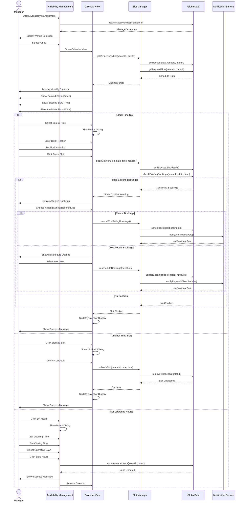
```mermaid
sequenceDiagram
    actor Manager
    participant AvailabilityUI as Availability Management
    participant CalendarUI as Calendar View
    participant SlotManager as Slot Manager
    participant GlobalData as GlobalData
    participant NotificationService as Notification Service

    Manager->>AvailabilityUI: Open Availability Management
    AvailabilityUI->>GlobalData: getManagerVenues(managerId)
    GlobalData-->>AvailabilityUI: Manager's Venues
    AvailabilityUI->>Manager: Display Venue Selection
    
    Manager->>AvailabilityUI: Select Venue
    AvailabilityUI->>CalendarUI: Open Calendar View
    CalendarUI->>SlotManager: getVenueSchedule(venueId, month)
    SlotManager->>GlobalData: getBookedSlots(venueId, month)
    SlotManager->>GlobalData: getBlockedSlots(venueId, month)
    GlobalData-->>SlotManager: Schedule Data
    SlotManager-->>CalendarUI: Calendar Data
    
    CalendarUI->>Manager: Display Monthly Calendar
    CalendarUI->>Manager: Show Booked Slots (Green)
    CalendarUI->>Manager: Show Blocked Slots (Red)
    CalendarUI->>Manager: Show Available Slots (White)
    
    alt Block Time Slot
        Manager->>CalendarUI: Select Date & Time
        CalendarUI->>CalendarUI: Show Block Dialog
        Manager->>CalendarUI: Enter Block Reason
        Manager->>CalendarUI: Set Block Duration
        Manager->>CalendarUI: Click Block Slot
        
        CalendarUI->>SlotManager: blockSlot(venueId, date, time, reason)
        SlotManager->>GlobalData: addBlockedSlot(details)
        
        SlotManager->>GlobalData: checkExistingBookings(venueId, date, time)
        alt Has Existing Bookings
            GlobalData-->>SlotManager: Conflicting Bookings
            SlotManager-->>CalendarUI: Show Conflict Warning
            CalendarUI->>Manager: Display Affected Bookings
            Manager->>CalendarUI: Choose Action (Cancel/Reschedule)
            
            alt Cancel Bookings
                CalendarUI->>SlotManager: cancelConflictingBookings()
                SlotManager->>GlobalData: cancelBookings(bookingIds)
                SlotManager->>NotificationService: notifyAffectedPlayers()
                NotificationService-->>SlotManager: Notifications Sent
            else Reschedule Bookings
                CalendarUI->>Manager: Show Reschedule Options
                Manager->>CalendarUI: Select New Slots
                CalendarUI->>SlotManager: rescheduleBookings(newSlots)
                SlotManager->>GlobalData: updateBookings(bookingIds, newSlots)
                SlotManager->>NotificationService: notifyPlayersOfReschedule()
                NotificationService-->>SlotManager: Notifications Sent
            end
        else No Conflicts
            GlobalData-->>SlotManager: No Conflicts
        end
        
        SlotManager-->>CalendarUI: Slot Blocked
        CalendarUI->>CalendarUI: Update Calendar Display
        CalendarUI->>Manager: Show Success Message
        
    else Unblock Time Slot
        Manager->>CalendarUI: Click Blocked Slot
        CalendarUI->>CalendarUI: Show Unblock Dialog
        Manager->>CalendarUI: Confirm Unblock
        CalendarUI->>SlotManager: unblockSlot(venueId, date, time)
        SlotManager->>GlobalData: removeBlockedSlot(slotId)
        GlobalData-->>SlotManager: Slot Unblocked
        SlotManager-->>CalendarUI: Success
        CalendarUI->>CalendarUI: Update Calendar Display
        CalendarUI->>Manager: Show Success Message
        
    else Set Operating Hours
        Manager->>AvailabilityUI: Click Set Hours
        AvailabilityUI->>AvailabilityUI: Show Hours Dialog
        Manager->>AvailabilityUI: Set Opening Time
        Manager->>AvailabilityUI: Set Closing Time
        Manager->>AvailabilityUI: Select Operating Days
        Manager->>AvailabilityUI: Click Save Hours
        
        AvailabilityUI->>GlobalData: updateVenueHours(venueId, hours)
        GlobalData-->>AvailabilityUI: Hours Updated
        AvailabilityUI->>Manager: Show Success Message
        AvailabilityUI->>CalendarUI: Refresh Calendar
    end
```

---

## 16. Venue Management (Manager - Future Feature)

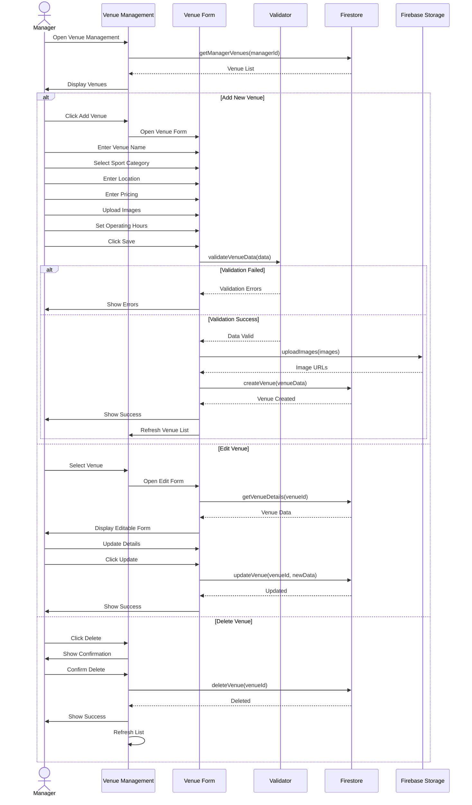
```mermaid
sequenceDiagram
    actor Manager
    participant VenueUI as Venue Management
    participant Form as Venue Form
    participant Validator as Validator
    participant Firebase as Firestore
    participant Storage as Firebase Storage

    Manager->>VenueUI: Open Venue Management
    VenueUI->>Firebase: getManagerVenues(managerId)
    Firebase-->>VenueUI: Venue List
    VenueUI->>Manager: Display Venues
    
    alt Add New Venue
        Manager->>VenueUI: Click Add Venue
        VenueUI->>Form: Open Venue Form
        
        Manager->>Form: Enter Venue Name
        Manager->>Form: Select Sport Category
        Manager->>Form: Enter Location
        Manager->>Form: Enter Pricing
        Manager->>Form: Upload Images
        Manager->>Form: Set Operating Hours
        Manager->>Form: Click Save
        
        Form->>Validator: validateVenueData(data)
        alt Validation Failed
            Validator-->>Form: Validation Errors
            Form->>Manager: Show Errors
        else Validation Success
            Validator-->>Form: Data Valid
            Form->>Storage: uploadImages(images)
            Storage-->>Form: Image URLs
            Form->>Firebase: createVenue(venueData)
            Firebase-->>Form: Venue Created
            Form->>Manager: Show Success
            Form->>VenueUI: Refresh Venue List
        end
        
    else Edit Venue
        Manager->>VenueUI: Select Venue
        VenueUI->>Form: Open Edit Form
        Form->>Firebase: getVenueDetails(venueId)
        Firebase-->>Form: Venue Data
        Form->>Manager: Display Editable Form
        
        Manager->>Form: Update Details
        Manager->>Form: Click Update
        Form->>Firebase: updateVenue(venueId, newData)
        Firebase-->>Form: Updated
        Form->>Manager: Show Success
        
    else Delete Venue
        Manager->>VenueUI: Click Delete
        VenueUI->>Manager: Show Confirmation
        Manager->>VenueUI: Confirm Delete
        VenueUI->>Firebase: deleteVenue(venueId)
        Firebase-->>VenueUI: Deleted
        VenueUI->>Manager: Show Success
        VenueUI->>VenueUI: Refresh List
    end
```

---

## 17. Manager Tournament Oversight

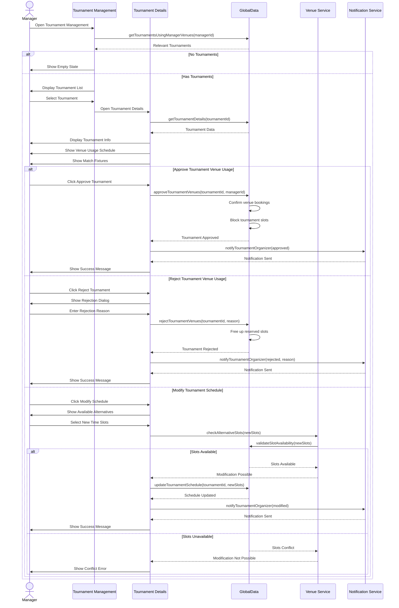
```mermaid
sequenceDiagram
    actor Manager
    participant TournamentUI as Tournament Management
    participant TournamentDetail as Tournament Details
    participant GlobalData as GlobalData
    participant VenueService as Venue Service
    participant NotificationService as Notification Service

    Manager->>TournamentUI: Open Tournament Management
    TournamentUI->>GlobalData: getTournamentsUsingManagerVenues(managerId)
    GlobalData-->>TournamentUI: Relevant Tournaments
    
    alt No Tournaments
        TournamentUI->>Manager: Show Empty State
    else Has Tournaments
        TournamentUI->>Manager: Display Tournament List
        
        Manager->>TournamentUI: Select Tournament
        TournamentUI->>TournamentDetail: Open Tournament Details
        TournamentDetail->>GlobalData: getTournamentDetails(tournamentId)
        GlobalData-->>TournamentDetail: Tournament Data
        TournamentDetail->>Manager: Display Tournament Info
        TournamentDetail->>Manager: Show Venue Usage Schedule
        TournamentDetail->>Manager: Show Match Fixtures
        
        alt Approve Tournament Venue Usage
            Manager->>TournamentDetail: Click Approve Tournament
            TournamentDetail->>GlobalData: approveTournamentVenues(tournamentId, managerId)
            GlobalData->>GlobalData: Confirm venue bookings
            GlobalData->>GlobalData: Block tournament slots
            GlobalData-->>TournamentDetail: Tournament Approved
            TournamentDetail->>NotificationService: notifyTournamentOrganizer(approved)
            NotificationService-->>TournamentDetail: Notification Sent
            TournamentDetail->>Manager: Show Success Message
            
        else Reject Tournament Venue Usage
            Manager->>TournamentDetail: Click Reject Tournament
            TournamentDetail->>Manager: Show Rejection Dialog
            Manager->>TournamentDetail: Enter Rejection Reason
            TournamentDetail->>GlobalData: rejectTournamentVenues(tournamentId, reason)
            GlobalData->>GlobalData: Free up reserved slots
            GlobalData-->>TournamentDetail: Tournament Rejected
            TournamentDetail->>NotificationService: notifyTournamentOrganizer(rejected, reason)
            NotificationService-->>TournamentDetail: Notification Sent
            TournamentDetail->>Manager: Show Success Message
            
        else Modify Tournament Schedule
            Manager->>TournamentDetail: Click Modify Schedule
            TournamentDetail->>Manager: Show Available Alternatives
            Manager->>TournamentDetail: Select New Time Slots
            TournamentDetail->>VenueService: checkAlternativeSlots(newSlots)
            VenueService->>GlobalData: validateSlotAvailability(newSlots)
            
            alt Slots Available
                GlobalData-->>VenueService: Slots Available
                VenueService-->>TournamentDetail: Modification Possible
                TournamentDetail->>GlobalData: updateTournamentSchedule(tournamentId, newSlots)
                GlobalData-->>TournamentDetail: Schedule Updated
                TournamentDetail->>NotificationService: notifyTournamentOrganizer(modified)
                NotificationService-->>TournamentDetail: Notification Sent
                TournamentDetail->>Manager: Show Success Message
            else Slots Unavailable
                GlobalData-->>VenueService: Slots Conflict
                VenueService-->>TournamentDetail: Modification Not Possible
                TournamentDetail->>Manager: Show Conflict Error
            end
        end
    end
```

---

## 18. Real-time Slot Availability Check

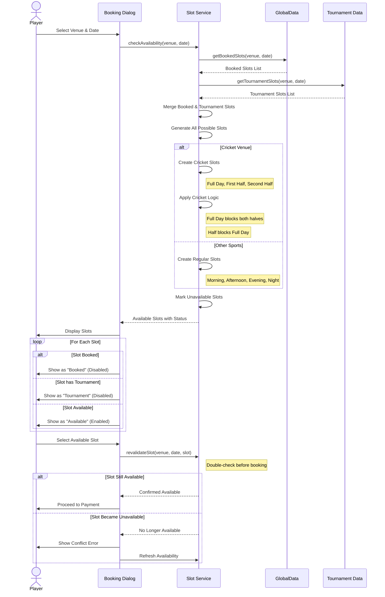
```mermaid
sequenceDiagram
    actor Player
    participant BookingUI as Booking Dialog
    participant SlotService as Slot Service
    participant GlobalData as GlobalData
    participant TournamentData as Tournament Data

    Player->>BookingUI: Select Venue & Date
    BookingUI->>SlotService: checkAvailability(venue, date)
    
    SlotService->>GlobalData: getBookedSlots(venue, date)
    GlobalData-->>SlotService: Booked Slots List
    
    SlotService->>TournamentData: getTournamentSlots(venue, date)
    TournamentData-->>SlotService: Tournament Slots List
    
    SlotService->>SlotService: Merge Booked & Tournament Slots
    SlotService->>SlotService: Generate All Possible Slots
    
    alt Cricket Venue
        SlotService->>SlotService: Create Cricket Slots
        Note right of SlotService: Full Day, First Half, Second Half
        SlotService->>SlotService: Apply Cricket Logic
        Note right of SlotService: Full Day blocks both halves
        Note right of SlotService: Half blocks Full Day
    else Other Sports
        SlotService->>SlotService: Create Regular Slots
        Note right of SlotService: Morning, Afternoon, Evening, Night
    end
    
    SlotService->>SlotService: Mark Unavailable Slots
    SlotService-->>BookingUI: Available Slots with Status
    
    BookingUI->>Player: Display Slots
    loop For Each Slot
        alt Slot Booked
            BookingUI->>Player: Show as "Booked" (Disabled)
        else Slot has Tournament
            BookingUI->>Player: Show as "Tournament" (Disabled)
        else Slot Available
            BookingUI->>Player: Show as "Available" (Enabled)
        end
    end
    
    Player->>BookingUI: Select Available Slot
    BookingUI->>SlotService: revalidateSlot(venue, date, slot)
    Note right of SlotService: Double-check before booking
    
    alt Slot Still Available
        SlotService-->>BookingUI: Confirmed Available
        BookingUI->>Player: Proceed to Payment
    else Slot Became Unavailable
        SlotService-->>BookingUI: No Longer Available
        BookingUI->>Player: Show Conflict Error
        BookingUI->>SlotService: Refresh Availability
    end
```

---

## System Architecture Overview

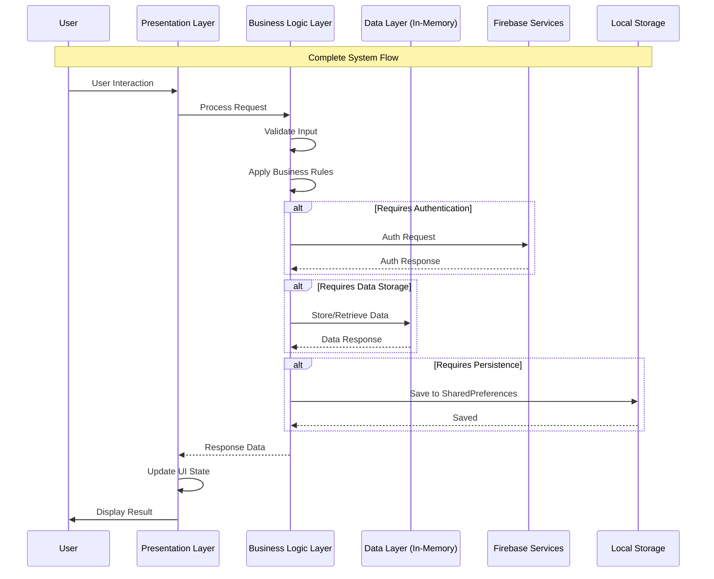
```mermaid
sequenceDiagram
    participant User
    participant UI as Presentation Layer
    participant Service as Business Logic Layer
    participant GlobalData as Data Layer (In-Memory)
    participant Firebase as Firebase Services
    participant Storage as Local Storage

    Note over User,Storage: Complete System Flow
    
    User->>UI: User Interaction
    UI->>Service: Process Request
    
    Service->>Service: Validate Input
    Service->>Service: Apply Business Rules
    
    alt Requires Authentication
        Service->>Firebase: Auth Request
        Firebase-->>Service: Auth Response
    end
    
    alt Requires Data Storage
        Service->>GlobalData: Store/Retrieve Data
        GlobalData-->>Service: Data Response
    end
    
    alt Requires Persistence
        Service->>Storage: Save to SharedPreferences
        Storage-->>Service: Saved
    end
    
    Service-->>UI: Response Data
    UI->>UI: Update UI State
    UI->>User: Display Result
```

---

## Notes

- All sequence diagrams use Mermaid syntax for easy rendering
- Diagrams show the interaction between actors, UI components, services, and data layers
- Error handling and validation flows are included
- Future features are marked accordingly
- Each diagram represents a complete user journey for the feature

---

**Document Version:** 1.0  
**Last Updated:** December 4, 2024  
**Application:** PlaySphere - Sports Venue Booking System
