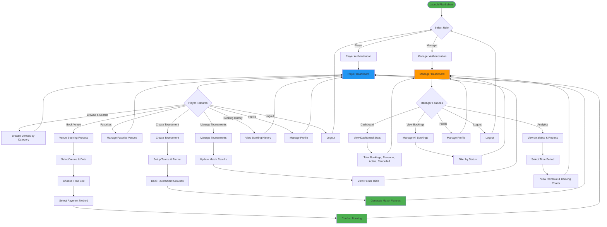

# PlaySphere - Main Features Activity Diagram

This document contains a simplified activity diagram showing the main features of the PlaySphere sports venue booking application.

---

## Main Features Activity Diagram

---

## Main Features Summary

### Player Features
1. **Authentication** - Login/Signup
2. **Browse Venues** - Search and filter by sport category
3. **Venue Booking** - Select venue, date, time slot, and payment method
4. **Favorites** - Save and manage favorite venues
5. **Create Tournament** - Setup teams, format, and book grounds
6. **Manage Tournaments** - Update match results and view standings
7. **Booking History** - View past bookings
8. **Profile Management** - Edit profile and logout

### Manager Features
1. **Authentication** - Login/Signup
2. **Dashboard** - View quick statistics (bookings, revenue)
3. **Manage Bookings** - View and filter all bookings
4. **Analytics** - View charts and reports for different time periods
5. **Profile Management** - Edit profile and logout

### Color Coding
- **Green**: Success states and start point
- **Blue**: Player dashboard
- **Orange**: Manager dashboard

---

**Document Version:** 1.0  
**Last Updated:** December 3, 2024  
**Application:** PlaySphere - Sports Venue Booking System
