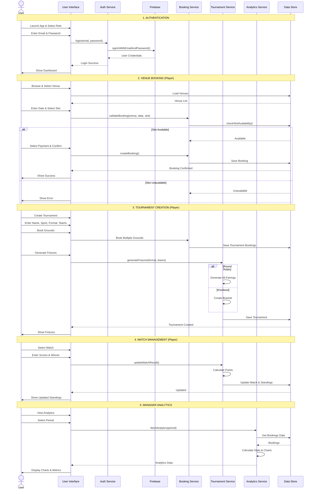

# PlaySphere - Main Features Sequence Diagram

This document contains a single sequence diagram showing the core main features of the PlaySphere sports venue booking application.

---

## Main Features Flow - Unified Sequence Diagram

---

## Main Features Overview

### 1. Authentication
- User login with email/password
- Firebase authentication
- Role-based access (Player/Manager)

### 2. Venue Booking
- Browse venues by category
- Select date and time slot
- Real-time availability checking
- Payment method selection
- Booking confirmation

### 3. Tournament Creation
- Enter tournament details (name, sport, format, teams)
- Book multiple grounds for tournament
- Automatic fixture generation
- Support for Round Robin and Knockout formats

### 4. Match Management
- View tournament fixtures
- Update match results
- Automatic points calculation
- Real-time standings update

### 5. Manager Analytics
- View booking statistics
- Revenue tracking
- Time period filtering (Weekly/Monthly/Yearly)
- Visual charts and metrics

---

## Components

- **User**: Player or Manager
- **UI**: User Interface Layer
- **Auth Service**: Authentication handling
- **Firebase**: Backend authentication
- **Booking Service**: Venue booking logic
- **Tournament Service**: Tournament & fixture management
- **Analytics Service**: Data analysis & reporting
- **GlobalData**: In-memory data storage

---

**Document Version:** 1.0  
**Last Updated:** December 4, 2024  
**Application:** PlaySphere - Sports Venue Booking System
