# PlaySphere - Main Use Case Diagram

This document contains a comprehensive use case diagram showing the main flow and interactions of the PlaySphere sports venue booking application.

---

## Main Use Case Diagram

```mermaid
graph TB
    %% Actors
    Player((Player))
    Manager((Manager))
    System((Firebase<br/>System))
    
    %% Authentication Use Cases
    subgraph Authentication["🔐 Authentication System"]
        UC1[Register Account]
        UC2[Login to System]
        UC3[Reset Password]
        UC4[Logout]
        UC5[Manage Profile]
    end
    
    %% Player Use Cases
    subgraph PlayerFeatures["⚽ Player Features"]
        UC6[Browse Venues]
        UC7[Search Venues]
        UC8[Book Venue]
        UC9[View Booking History]
        UC10[Manage Favorites]
        UC11[Create Tournament]
        UC12[Manage Tournament]
        UC13[Update Match Results]
        UC14[View Tournament Fixtures]
    end
    
    %% Manager Use Cases
    subgraph ManagerFeatures["📊 Manager Features"]
        UC15[View Dashboard]
        UC16[View All Bookings]
        UC17[View Analytics]
        UC18[Generate Reports]
        UC19[Track Revenue]
        UC20[Monitor Venue Performance]
    end
    
    %% Shared Use Cases
    subgraph SharedFeatures["🔄 Shared Features"]
        UC21[Update Profile Picture]
        UC22[Change Password]
        UC23[View Notifications]
    end
    
    %% System Use Cases
    subgraph SystemFeatures["⚙️ System Operations"]
        UC24[Authenticate User]
        UC25[Validate Booking]
        UC26[Check Slot Availability]
        UC27[Generate Fixtures]
        UC28[Calculate Points]
        UC29[Store Data]
        UC30[Send Email]
    end
    
    %% Player Connections
    Player -->|registers as| UC1
    Player -->|logs in| UC2
    Player -->|resets| UC3
    Player -->|logs out| UC4
    Player -->|manages| UC5
    Player -->|browses| UC6
    Player -->|searches| UC7
    Player -->|books| UC8
    Player -->|views| UC9
    Player -->|manages| UC10
    Player -->|creates| UC11
    Player -->|manages| UC12
    Player -->|updates| UC13
    Player -->|views| UC14
    Player -->|updates| UC21
    Player -->|changes| UC22
    Player -->|views| UC23
    
    %% Manager Connections
    Manager -->|registers as| UC1
    Manager -->|logs in| UC2
    Manager -->|resets| UC3
    Manager -->|logs out| UC4
    Manager -->|manages| UC5
    Manager -->|views| UC15
    Manager -->|views| UC16
    Manager -->|views| UC17
    Manager -->|generates| UC18
    Manager -->|tracks| UC19
    Manager -->|monitors| UC20
    Manager -->|updates| UC21
    Manager -->|changes| UC22
    Manager -->|views| UC23
    
    %% System Connections
    UC1 -.->|uses| UC24
    UC2 -.->|uses| UC24
    UC3 -.->|uses| UC30
    UC8 -.->|uses| UC25
    UC8 -.->|uses| UC26
    UC11 -.->|uses| UC27
    UC13 -.->|uses| UC28
    UC1 -.->|uses| UC29
    UC8 -.->|uses| UC29
    UC11 -.->|uses| UC29
    
    System -.->|performs| UC24
    System -.->|performs| UC25
    System -.->|performs| UC26
    System -.->|performs| UC27
    System -.->|performs| UC28
    System -.->|performs| UC29
    System -.->|performs| UC30
    
    %% Include Relationships
    UC6 -.->|includes| UC7
    UC8 -.->|includes| UC26
    UC11 -.->|includes| UC8
    UC12 -.->|includes| UC14
    UC12 -.->|includes| UC13
    UC17 -.->|includes| UC18
    UC5 -.->|includes| UC21
    UC5 -.->|includes| UC22
    
    %% Extend Relationships
    UC10 -.->|extends| UC6
    UC9 -.->|extends| UC8
    UC14 -.->|extends| UC11
    UC19 -.->|extends| UC15
    UC20 -.->|extends| UC15
    
    %% Styling
    classDef actorStyle fill:#4A90E2,stroke:#2E5C8A,stroke-width:3px,color:#fff
    classDef authStyle fill:#50C878,stroke:#2E7D4E,stroke-width:2px
    classDef playerStyle fill:#FF6B6B,stroke:#C92A2A,stroke-width:2px
    classDef managerStyle fill:#9B59B6,stroke:#6C3483,stroke-width:2px
    classDef sharedStyle fill:#F39C12,stroke:#B8730F,stroke-width:2px
    classDef systemStyle fill:#34495E,stroke:#1C2833,stroke-width:2px
    
    class Player,Manager,System actorStyle
    class UC1,UC2,UC3,UC4,UC5 authStyle
    class UC6,UC7,UC8,UC9,UC10,UC11,UC12,UC13,UC14 playerStyle
    class UC15,UC16,UC17,UC18,UC19,UC20 managerStyle
    class UC21,UC22,UC23 sharedStyle
    class UC24,UC25,UC26,UC27,UC28,UC29,UC30 systemStyle
```



---

## Use Case Descriptions

### Authentication System

| Use Case ID | Use Case Name | Description | Actors |
|-------------|---------------|-------------|--------|
| UC1 | Register Account | User creates a new account with role selection (Player/Manager) | Player, Manager |
| UC2 | Login to System | User authenticates with email and password | Player, Manager |
| UC3 | Reset Password | User requests password reset via email | Player, Manager |
| UC4 | Logout | User signs out from the application | Player, Manager |
| UC5 | Manage Profile | User views and updates profile information | Player, Manager |

### Player Features

| Use Case ID | Use Case Name | Description | Actors |
|-------------|---------------|-------------|--------|
| UC6 | Browse Venues | Player views venues by sport category | Player |
| UC7 | Search Venues | Player searches venues by name or category | Player |
| UC8 | Book Venue | Player books a venue for specific date and time slot | Player |
| UC9 | View Booking History | Player views past and upcoming bookings | Player |
| UC10 | Manage Favorites | Player adds/removes venues to/from favorites | Player |
| UC11 | Create Tournament | Player creates a tournament with teams and format | Player |
| UC12 | Manage Tournament | Player manages tournament matches and schedule | Player |
| UC13 | Update Match Results | Player enters scores and declares match winners | Player |
| UC14 | View Tournament Fixtures | Player views tournament schedule and brackets | Player |

### Manager Features

| Use Case ID | Use Case Name | Description | Actors |
|-------------|---------------|-------------|--------|
| UC15 | View Dashboard | Manager views quick statistics and overview | Manager |
| UC16 | View All Bookings | Manager views all venue bookings | Manager |
| UC17 | View Analytics | Manager views revenue and booking analytics | Manager |
| UC18 | Generate Reports | Manager generates analytics reports for specific periods | Manager |
| UC19 | Track Revenue | Manager monitors total revenue and trends | Manager |
| UC20 | Monitor Venue Performance | Manager tracks venue utilization and performance | Manager |

### Shared Features

| Use Case ID | Use Case Name | Description | Actors |
|-------------|---------------|-------------|--------|
| UC21 | Update Profile Picture | User uploads/changes profile picture | Player, Manager |
| UC22 | Change Password | User changes account password | Player, Manager |
| UC23 | View Notifications | User views system notifications (Future) | Player, Manager |

### System Operations

| Use Case ID | Use Case Name | Description | Actors |
|-------------|---------------|-------------|--------|
| UC24 | Authenticate User | System validates user credentials via Firebase | System |
| UC25 | Validate Booking | System checks booking validity and conflicts | System |
| UC26 | Check Slot Availability | System verifies time slot availability | System |
| UC27 | Generate Fixtures | System creates tournament fixtures based on format | System |
| UC28 | Calculate Points | System calculates team points and standings | System |
| UC29 | Store Data | System persists data to database | System |
| UC30 | Send Email | System sends password reset emails | System |

---

## Relationships

### Include Relationships
- **Browse Venues** includes **Search Venues** - Searching is part of browsing
- **Book Venue** includes **Check Slot Availability** - Availability check is mandatory
- **Create Tournament** includes **Book Venue** - Tournament requires venue booking
- **Manage Tournament** includes **View Tournament Fixtures** - Viewing fixtures is part of management
- **Manage Tournament** includes **Update Match Results** - Updating results is part of management
- **View Analytics** includes **Generate Reports** - Reports are part of analytics
- **Manage Profile** includes **Update Profile Picture** - Picture update is part of profile management
- **Manage Profile** includes **Change Password** - Password change is part of profile management

### Extend Relationships
- **Manage Favorites** extends **Browse Venues** - Optional feature while browsing
- **View Booking History** extends **Book Venue** - Optional to view history after booking
- **View Tournament Fixtures** extends **Create Tournament** - Optional to view after creation
- **Track Revenue** extends **View Dashboard** - Optional detailed view from dashboard
- **Monitor Venue Performance** extends **View Dashboard** - Optional detailed view from dashboard

---

## Main Application Flow

### 1. User Registration & Authentication
```
Start → Select Role (Player/Manager) → Register → Login → Dashboard
```

### 2. Player Main Flow
```
Player Dashboard → Browse Venues → Select Venue → Book Venue → 
Check Availability → Confirm Booking → Booking Confirmation
```

### 3. Tournament Flow
```
Create Tournament → Enter Details → Book Grounds → Generate Fixtures → 
Manage Matches → Update Results → Calculate Points → View Standings
```

### 4. Manager Main Flow
```
Manager Dashboard → View Quick Stats → View Bookings → 
View Analytics → Generate Reports → Monitor Performance
```

### 5. Profile Management Flow
```
Profile Screen → Edit Information → Update Picture → 
Change Password → Save Changes → Confirmation
```

---

## Actor Descriptions

### Player
- **Primary Goal:** Book sports venues and organize tournaments
- **Key Activities:** Browse venues, make bookings, create tournaments, manage favorites
- **Access Level:** Player-specific features and shared features
- **Typical Usage:** Regular bookings, tournament organization, venue discovery

### Manager
- **Primary Goal:** Manage venue bookings and track business performance
- **Key Activities:** Monitor bookings, view analytics, track revenue, manage venues
- **Access Level:** Manager-specific features and shared features
- **Typical Usage:** Daily monitoring, weekly reports, performance analysis

### Firebase System
- **Primary Goal:** Provide backend services and data management
- **Key Activities:** Authentication, data storage, email services, validation
- **Access Level:** System-level operations
- **Typical Usage:** Continuous background operations

---

## System Boundaries

### In Scope
- User authentication and authorization
- Venue browsing and booking
- Tournament creation and management
- Favorites management
- Booking history tracking
- Manager dashboard and analytics
- Profile management
- Password management

### Out of Scope (Future Enhancements)
- Real-time chat functionality
- Payment gateway integration
- GPS-based venue discovery
- User reviews and ratings
- Push notifications
- Social media integration
- Multi-language support

---

## Use Case Priorities

### High Priority (MVP)
- UC1: Register Account
- UC2: Login to System
- UC6: Browse Venues
- UC8: Book Venue
- UC11: Create Tournament
- UC15: View Dashboard
- UC17: View Analytics

### Medium Priority
- UC3: Reset Password
- UC7: Search Venues
- UC9: View Booking History
- UC10: Manage Favorites
- UC12: Manage Tournament
- UC16: View All Bookings

### Low Priority (Future)
- UC23: View Notifications
- UC18: Generate Reports (Export)
- UC20: Monitor Venue Performance (Advanced)

---

**Document Version:** 1.0  
**Last Updated:** December 4, 2024  
**Application:** PlaySphere - Sports Venue Booking System  
**Diagram Type:** Use Case Diagram (Mermaid)

